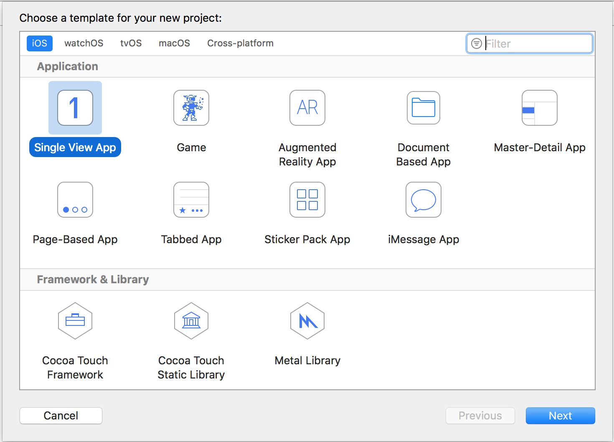
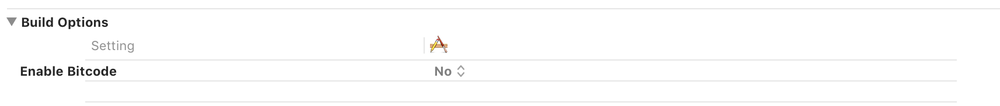
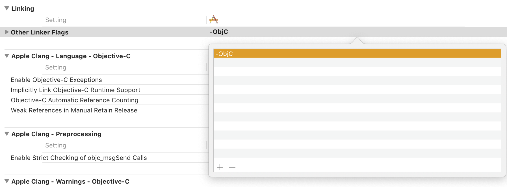
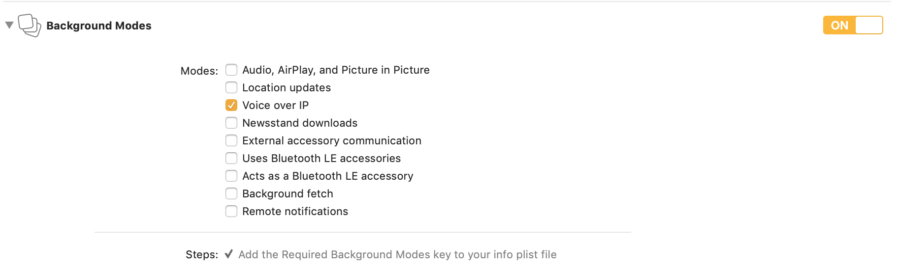
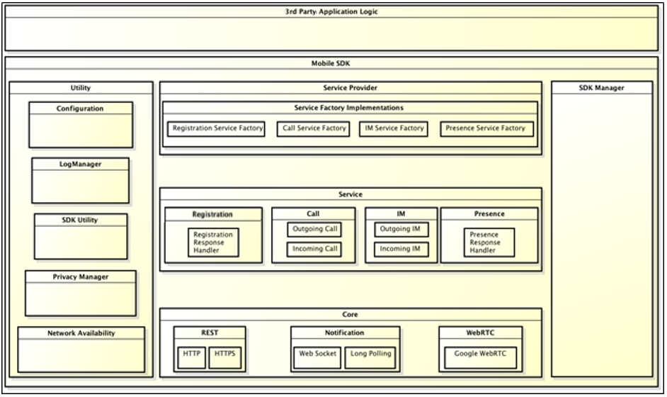
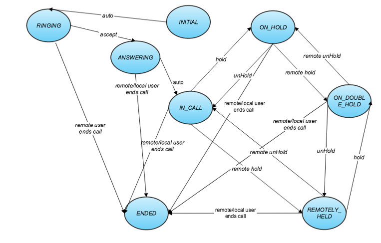
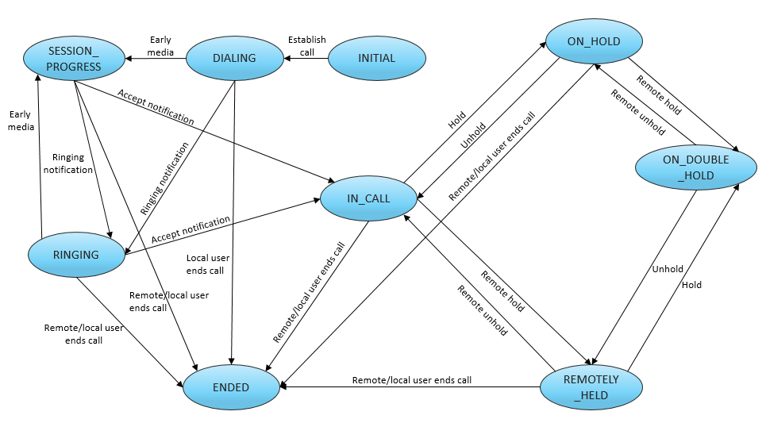

# Mobile SDK User Guide for iOS
Version Number: **5.0.0**
<br>
Revision Date: **October 2, 2019**

# Table of Contents

@[toc]

<div class="page-break"></div>

## Mobile SDK overview

The SPiDR/Kandy Link Mobile Software Development Kit (SDK) defines a library implementation supporting SPiDR platform features like registration, notification, call management, instant message, presence management, and WebRTC on iOS. You can use this library implementation to integrate SPiDR/Kandy Link services and WebRTC into your native mobile applications to create new, innovative user experiences.

The Mobile SDK has the following characteristics:

* supports REST over HTTP/HTTPS for integration with the presentation layer of SPiDR/Kandy Link
* supports WebSocket for notification
* built and distributed as a standard library structure for easy use in mobile applications
* most features are implemented based on factory and singleton design patterns
* classes contain a prefix "SM" ("SPiDR Mobile") to prevent conflicts with developer classes
* access to REST APIs provided by Ribbon's Kandy platform

See [Appendix A: High-level Mobile SDK structure](#appendix-a-high-level-mobile-sdk-structure) for a high-level view of the Mobile SDK and its sub-modules.

The Mobile SDK for iOS is compatible with iOS 9.x-12.x and has been tested on iPhone 4S, 5, 5C, 5S, 6, 6+, 6S, 6S+, 7, 7+, 8, 8+, X, iPad mini, iPad 4, and iPad Air. The SDK supports IPv6 for iOS.

### What's in this document?

This document provides help getting started developing your mobile application using the Mobile SDK for iOS. This guide contains:

* Steps to create your Xcode project using the Mobile SDK
* Sample code to illustrate common tasks

### Before you start developing your application

The following items need to be complete prior to beginning work on your application:

* You have downloaded the MobileSDK package from http://developer.genband.com/MobileSDK .
* You have extracted the contents of the MobileSDK package and located MobileSDK.framework.
* Your Xcode development environment is set up and ready for new projects.
* You know the IP address and port of the SPiDR/Kandy Link server.

<div class="page-break" />

## Get Started

### Installation

This section contains the required steps for beginning your mobile application development and an example of using the Mobile SDK in Xcode 10.x.


1. Open the Xcode application.
2. Click Create a new Xcode project.
3. Click Application, located under the iOS heading in the left-side panel.
4. Click Single View Application for your project template.



5. Click Next.
6. Type your project details and click Next.
7. Select a location for your project and click Create.
8. Select one of the installation methods below

#### Manual Installation
1. Navigate to Build Phases and scroll down to Link binary with libraries.
2. Add MobileSDK.framework under Link binary with libraries.
3. Add WebRTC.framework under the **Embedded Binaries** section in **General** tab on Project Settings. Select **Copy items if needed**.


4. Add the following iOS SDK frameworks to your application:

* AvFoundation.framework
* SystemConfiguration.framework
* GLKit.framework
* VideoToolbox.framework
* AudioToolbox.framework
* PushKit.framework
* libc++.tbd
* libicucore.tbd
* libz.tbd

5. Mobile SDK doesn't support bitcode, under the "Build Settings" search for "Bitcode", and change "Enable Bitcode" option to NO.



6. "-ObjC" flag should be added to "Other Linker Flags" options under the "Build Settings".



#### Cocoapods
1. Add below pods to your Podfile (If you dont have any Podfile, visit this link to install cocoapods: https://guides.cocoapods.org/using/using-cocoapods.html)

* pod 'KandyLinkMobileSDK'

2. Go to project folder via command line and run "pod install" command and wait for cocoapods to finish installation of MobileSDK ,WebRTC frameworks and their dependencies

### Post Installation Steps


1. Add usage descriptions for both camera and microphone access should be added to application's Info.plist file.

```tag
<key>NSCameraUsageDescription</key>
<string>Your camera usage description message should be added here like this.</string>
<key>NSMicrophoneUsageDescription</key>
<string>Your microphone usage description message should be added here like this.</string>
```

### Enable background processing

The application must support background processing while on an active call, allowing SDK to process WebSocket operations even after the user presses the Home button, the Sleep/Wake button, or if another application is launched.

To enable background processing, add the "UIBackgroundModes" key to your app's **Info.plist** file. Set the value of this key to an array that includes the **voip** string.



You can now use the Mobile SDK in your code implementation.

<div class="page-break"></div>

### Set application configuration

First, you must access and modify the Configuration utility to update attributes such as REST server IP or Port. The Mobile SDK receives data from the Configuration utility, and the third-party mobile application (third-party app) must provide necessary data to the Configuration utility. Example for basic configuration that needs Mobile SDK to work is shown in next page.

To see all available configurations, see [Appendix D: Detailed Configurations](#appendix-d-detailed-configurations)

<div class="page-break"></div>

###### Example: Accessing and updating Configuration

```obj-c
Objective-C

#import <MobileSDK/MobileSDK.h>

- (void) manageConfiguration
{
    //access SMConfiguration instance
    SMConfiguration * configuration =  [SMConfiguration getInstance];

    //after gathering the Configuration
    //a property X can be accessed as
    //configuration.X --> getter
    //configuration.X = --> setter

    //set minimum Configuration values
    //user name for authorization
    configuration.userName = @"username";
    //password for authorization
    configuration.password = @"password";
    //server IP value for SPiDR/Kandy Link
    configuration.restServerIP = @"127.0.0.1";
    //server port value for SPiDR/Kandy Link
    configuration.restServerPort = @"443";
    //logger implementation defined by application
    configuration.logger = self;

    //IP used in websocket connection creation.
    // If not provided, Rest Server IP will be used
    configuration.webSocketServerIP = @"127.0.0.1";
    //port used in websocket connection creation
    configuration.webSocketServerPort = @"443";

    // add ICE Server
    SMICEServers * servers = [[SMICEServers alloc] init];
    [servers addICEServer:@"turns:turn.spidr.com:443?transport=tcp"];
    [servers addICEServer:@"stun:stun1.spidr.com:3478?transport=udp"];
    [configuration setICEServers:servers];
}
```

```swift
Swift

import MobileSDK

func manageConfiguration() {
    //access SMConfiguration instance
    let configuration = SMConfiguration.getInstance()

    //after gathering the Configuration
    //a property X can be accessed as
    //configuration.X --> getter
    //configuration.X = --> setter

    //set minimum Configuration values
    //user name for authorization
    configuration.userName = "username"
    //password for authorization
    configuration.password = "password"
    //server IP value for SPiDR/Kandy Link
    configuration.restServerIP = "127.0.0.1"
    //server port value for SPiDR/Kandy Link
    configuration.restServerPort = "443"
    //logger implementation defined by application
    configuration.logger = self

    //IP used in websocket connection creation
    // If not provided, Rest Server IP will be used
    configuration.webSocketServerIP  = "127.0.0.1"
    //port used in websocket connection creation
    configuration.webSocketServerPort  = "443"

    // add ICE Server
    let servers = SMICEServers()
    servers.addICEServer("turns:turn.spidr.com:443?transport=tcp")
    servers.addICEServer("stun:stun1.spidr.com:3478?transport=udp")
    configuration.iceServers = servers
}
```

### Setup logging functionality

Logging provides a way to trace process execution. The Log Manager is defined to handle logging requests made by the Mobile SDK. The Log Manager does not process the logging messages, rather it receives logging message requests and delivers them to the logger defined in the Configuration utility (logger is initially "null"; you must set an object which conforms to LoggingInterface methods in the Configuration utility).

The Mobile SDK supports the following log levels:

* ERROR (all exceptions are logged at this level)
* WARNING
* INFO (used for tracing issues)
* TRACE
* VERBOSE
* TRACE_WEBRTC

###### Example: Define logger

```obj-c
Objective-C

#import <Foundation/Foundation.h>
@interface ExampleLogger : NSObject <SMLoggingDelegate>

@end

@implementation ExampleLogger

//a logger implementation only needs to implement "log" method
- (void) log:(LogLevel)logLevel withLogContext:(NSString * )logContext withMethodName(SEL) methodName withMessage:(NSString *)logMessage
{
    //this implementation only writes the INFO level logs to console, omits the rest
    if(logLevel == INFO)
    {
        NSLog(@"%@", [NSString stringWithFormat:@"[%@] [%@]", logContext, logMessage]);
    }
}
```

```swift
Swift

class ExampleLogger : NSObject, SMLoggingDelegate {

    //a logger implementation only needs to implement "log" method
    func log(_ logLevel: SMLogLevel, withLogContext logContext: String, withMethodName methodName: Selector?, withMessage logMessage: String) {
        //this implementation only writes the INFO level logs to console, omits the rest
        if(logLevel == .info) {
            NSLog("\(logContext) - \(logMessage)")
        }
    }

}
```

###### Example: Initialize logger

```obj-c
Objective-C

- (void) initializeAndUseLogger
{
    SMConfiguration * configuration = [SMConfiguration getInstance];
    ExampleLogger    * exampleLogger    = [[ExampleLogger alloc] init];
    configuration.logger          = exampleLogger;

    NSLog(@"logger is initialized");
}
```

```swift
Swift

func initializeAndUseLogger() {
    let configuration = SMConfiguration.getInstance()
    let exampleLogger = ExampleLogger()
    configuration.logger = exampleLogger

    NSLog("Logger is initialized")
}
```

<div class="page-break"></div>

## Registration Service

MobileSDK should be registered to SPiDR/Kandy Link before using any other services.

**Note:** The Configuration parameters must be set before using registration service

### Register the client

 Use the `registerToServer` method to register the client to the server with the values set in configuration. After the client is registered, the notification state will be changed to "CONNECTED", and the registration state is "REGISTERED". The client will try to stay in "REGISTERED" and "CONNECTED" states until the client is unregistered.

The `SMRegistrationApplicationDelegate` should be set to receive registration service notifications.

The registration service renews registration according to the expiration time with the help of SPiDR/Kandy Link's ping messages. The `getExpirationTime` method may be called after successful registration to retrieve the expiration time (in seconds) for registration.

<div class="page-break"></div>

###### Example: Registering to SPiDR/Kandy Link

```obj-c
Objective-C

#import <MobileSDK/MobileSDK.h>

@interface RegistrationController () <SMRegistrationApplicationDelegate>
@end

@implementation RegistrationController

- (void) registerExample {
    SMRegistrationService *regService = [[SMServiceProvider getInstance] getRegistrationService];
    //Get registration service notifications
    [regService setRegistrationApplicationDelegate:self];
    //Service types used in registration
    NSArray *services = @[[SMServiceTypes getCallService]];

    [regService registerToServer:services
                  expirationTime:3600
               completionHandler:^(SMMobileError *error) {
        if(error){
            //Handle registration error
            return;
        }

        //Handle registration success

        //Developer can get expiration time, which is gathered from registration response
        NSInteger expirationTime = [regService getExpirationTime];
    }];
}

- (void) registrationStateChanged:(SMRegistrationStates)registrationState {
    //Handle registration state changes
}

- (void) notificationStateChanged:(SMNotificationStates)notificationState
{
    //Handle notification state changes
}

- (void) internalErrorDidOccur:(SMMobileError*) error
{
	//This method will be called, if any internal error occurs when MobileSDK sends a request to SPiDR
}

@end
```

```swift
Swift

import MobileSDK

class RegistrationController: NSObject, SMRegistrationApplicationDelegate {

    func registerExample() {
        let regService = SMServiceProvider.getInstance().getRegistrationService()
        regService.registrationApplicationDelegate = self
        let services = [SMServiceTypes.getCallService()]
        regService.register(toServer: services, expirationTime: 3600) { (error) in
            if let error = error {
                // Handle registration error
                return
            }

            // Handle registration success
            // Developer can get expiration time, which is gathered from registration response
            let expirationTime = regService.getExpirationTime()
        }
    }

    func registrationStateChanged(_ registrationState: SMRegistrationStates) {
        //Handle registration state changes
    }

    func notificationStateChanged(_ notificationState: SMNotificationStates) {
        //Handle notification state changes
    }
    
    func internalErrorDidOccur(_ error: SMMobileError) {
    	//This method will be called, if any internal error occurs when MobileSDK sends a request to SPiDR
    }

}
```

<div class="page-break"></div>

### Unregister the client

To stop receiving events from SPiDR/Kandy Link, client should be unregistered. When unregistration is successful, the notification state will be changed to "DISCONNECTED", and the registration state is "UNREGISTERED".

###### Example: Unregistering from SPiDR/Kandy Link

```obj-c
Objective-C

#import <MobileSDK/MobileSDK.h>

@interface RegistrationController () <SMRegistrationApplicationDelegate>
@end

@implementation RegistrationController

- (void) unregisterExample {
    SMRegistrationService *regService = [[SMServiceProvider getInstance] getRegistrationService];
    //Service types used in registration

    [regService unRegisterFromServerWithHandler:^(SMMobileError *error) {
        if(error){
            //Handle unregistration error
            return;
        }

        //Handle unregistration success
    }];
}

- (void) registrationStateChanged:(SMRegistrationStates)registrationState {
    //Handle registration state changes
}

- (void) notificationStateChanged:(SMNotificationStates)notificationState
{
    //Handle notification state changes
}
@end
```

```swift
Swift

import MobileSDK

class RegistrationController: NSObject, SMRegistrationApplicationDelegate {

    func unregisterExample() {
        let regService = SMServiceProvider.getInstance().getRegistrationService()
        regService.unRegisterFromServer { (error) in
            if let error = error {
                // Handle unregistration error
                return
            }

            // Handle unregistration success
        }
    }

    func registrationStateChanged(_ registrationState: SMRegistrationStates) {
        //Handle registration state changes
    }

    func notificationStateChanged(_ notificationState: SMNotificationStates) {
        //Handle notification state changes
    }

}
```

<div class="page-break"></div>

### Register the client with AuthName

If client wants to register with using "AuthName", `authName` property in `SMConfiguration` should be set before registration.

###### Example: Registering with using Authname

```obj-c
Objective-C

SMRegistrationService *regService = [[SMServiceProvider getInstance] getRegistrationService];

//Set AuthName
SMConfiguration.getInstance().authName = @"AuthName";
SMConfiguration.getInstance().userName = @"username";
SMConfiguration.getInstance().password = @"password";

//Get registration service notifications
[regService setRegistrationApplicationDelegate:self];
//Service types used in registration
NSArray *services = @[[SMServiceTypes getCallService],
                      [SMServiceTypes getIMService],
                      [SMServiceTypes getPresenceService]];

[regService registerToServer:services
              expirationTime:3600
           completionHandler:^(SMMobileError *error) {
    if(error){
        //Handle registration error
        return;
    }

    //Handle registration success
}];
```

```swift
Swift

let regService = SMServiceProvider.getInstance().getRegistrationService()

//Set AuthName
SMConfiguration.getInstance().authName = "AuthName"
SMConfiguration.getInstance().userName = "username"
SMConfiguration.getInstance().password = "password"

regService.registrationApplicationDelegate = self
let services = [SMServiceTypes.getCallService(),
                SMServiceTypes.getIMService(),
                SMServiceTypes.getPresenceService()]
regService.register(toServer: services, expirationTime: 3600) { (error) in
    if let error = error {
        // Handle registration error
        return
    }

    // Handle registration success
    // Developer can get expiration time, which is gathered from registration response
    let expirationTime = regService.getExpirationTime()
}
```

<div class="page-break" />

## Call Service

### Basic Usage of Call Service

Create outgoing calls by providing the target contact address and related UI views for video display, or receive incoming calls from another user.

#### Listen Call Service notifications

To receive incoming calls and event notifications of call service, `SMCallApplicationDelegate` should be implemented by calling `setCallApplication:`.

Incoming calls pass to the third-party app by the notification mechanism. Both incoming and outgoing calls can be manipulated with methods such as mute/unmute and start/stop video.

###### Example: Setting Call Application Delegate

```obj-c
Objective-C

#import <MobileSDK/MobileSDK.h>

@interface CallController () <SMRegistrationApplicationDelegate, SMCallApplicationDelegate>
@end

@implementation CallController

- (void) registrationStateChanged:(SMRegistrationStates)registrationState {
    if (registrationState == REGISTERED) {
        [[[SMServiceProvider getInstance] getCallService] setCallApplication:self];
    }
}

@end
```

```swift
Swift

import MobileSDK

class CallController: NSObject, SMRegistrationApplicationDelegate, SMCallApplicationDelegate {

    func registrationStateChanged(_ registrationState: SMRegistrationStates) {
        if registrationState == .registered {
            SMServiceProvider.getInstance().getCallService().setCallApplication(self)
        }
    }

}
```

#### Add STUN/TURN servers

SPiDR/Kandy Link provides TURN server support for media relay between two WebRTC endpoints in core version 3.0 and later. The ICEServers property in the SMConfiguration class is used to store the ICE servers list; more than one ICEServer can exist in this property.

##### Add SPiDR's (Kandy Link) TURN server

After registration, the Mobile SDK gets default credentials from SPiDR/Kandy Link for the TURN servers and updates the defaultICEUsername and defaultICEPassword configuration properties. The list of ICEServers and their credentials are added to the PeerConnection when creating a call.

The following code sample will request TURN server credentials from SPiDR/Kandy Link and update the configuration instance.

**Note:** If your SPiDR/Kandy Link core version does not have TURN Server support, adding a TURN server without a username and password will cause the registration request to fail.

###### Example: Adding STUN/TURN server

```obj-c
Objective-C

SMICEServers *servers = [[SMICEServers alloc] init];
[servers addICEServer:@"turns:turn1.spidr.com:443?transport=tcp"];
[servers addICEServer:@"stun:turn1.spidr.com:3478?transport=udp"];
[servers addICEServer:@"turns:turn2.spidr.com:443?transport=tcp"];
[servers addICEServer:@"stun:turn2.spidr.com:3478?transport=udp"];
[[SMConfiguration getInstance] setICEServers:servers];
```

```swift
Swift

var servers = SMIceServers()
servers.addICEServer("turns:turn1.spidr.com:443?transport=tcp")
servers.addICEServer("stun:turn1.spidr.com:3478?transport=udp")
servers.addICEServer("turns:turn2.spidr.com:443?transport=tcp")
servers.addICEServer("stun:turn2.spidr.com:3478?transport=udp")
SMConfiguration.getInstance().iceServers = servers
```

##### Add an external TURN/STUN server

You also have the option of using external TURN/STUN servers while establishing calls rather than SPiDR's (Kandy Link) TURN server(s). The ICEServers property will store the address and username/password for the server(s).

Use the addICEServer:username:password: method of the ICEServers object to define credentials.

###### Example: Add a STUN server

```obj-c
Objective-C

SMICEServers *servers = [[SMICEServers alloc] init];
[servers addICEServer:@"stun:stun1.spidr.com:8322"];
[[SMConfiguration getInstance] setICEServers:servers];
// or
SMICEServers *servers = [[SMConfiguration getInstance] SMICEServers];
[servers addICEServer:@"stun:stun1.spidr.com:8322"];
```

```swift
Swift

var servers = SMIceServers()
servers.addICEServer("stun:stun1.spidr.com:8322")
SMConfiguration.getInstance().iceServers = servers
// or
SMConfiguration.getInstance().iceServers?.addICEServer("stun:stun1.spidr.com:8322")
```

<div class="page-break"></div>

###### Example: Add a TURN server

```obj-c
Objective-C

SMICEServers *servers = [[SMConfiguration getInstance] SMICEServers];
//to use UDP transport
[servers addICEServer:@"turn:turn1.spidr.com:4432?transport=udp" username:@"username" password:@"password"];
//to use TCP transport
[servers addICEServer:@"turn:turn2.spidr.com:4432?transport=tcp" username:@"username" password:@"password"];
//to use TLS transport
[servers addICEServer:@"turns:turn3.spidr.com:4432?transport=tcp" username:@"username" password:@"password"];
```

```swift
Swift

var servers = SMConfiguration.getInstance().iceServers
//to use UDP transport
servers.addICEServer("turn:turn1.spidr.com:4432?transport=udp", username: "username" password: "password")
//to use TCP transport
servers.addICEServer("turn:turn2.spidr.com:4432?transport=tcp", username: "username" password: "password")
//to use TLS transport
servers.addICEServer("turns:turn3.spidr.com:4432?transport=tcp", username: "username" password: "password")
```

###### Example: Get the server(s)

```obj-c
Objective-C

SMICEServers *iceServers = [[SMConfiguration getInstance] SMICEServers];

//credentials may also be updated directly
NSArray  *serversArray = [iceServers servers];
NSString *urlOfFirst  = serversArray.firstObject.url;
NSString *userOfFirst = serversArray.firstObject.username;
NSString *passOfFirst = serversArray.firstObject.password;
```

```swift
Swift

var iceServers = SMConfiguration.getInstance().iceServers!

//credentials may also be updated directly
let serversArray = iceServers.servers()
let urlOfFirst  = serversArray.first?.url
let userOfFirst = serversArray.first?.username
let passOfFirst = serversArray.first?.password
```

If a server URL is entered multiple times, the last username and password will be used for the specified server. To remove a server, you must dispose the existing one and create a new instance, defining necessary servers again.

<div class="page-break"></div>

#### Make an outgoing call

Use the `createOutgoingCall` functionality to place audio only or audio/video calls. The MobileSDK also supports establishing calls with only one m line (audio only) or with two m lines (audio and video or one sendrecv/sendonly audio and one recvonly video m line). The number of m lines in the response should match the number of m lines in the initial offer.

###### Example: Establishing an outgoing call

```obj-c
Objective-C

- (void) callExample
{
    SMUriAddress *calleeAddress = [[SMUriAddress alloc] initWithPrimaryContact:@"user@domain"];
    UIView * localVideoView;  //make an assignment
    UIView * remoteVideoView; //make an assignment

    [[[SMServiceProvider getInstance] getCallService] createOutGoingCall:self
              andTerminator:calleeAddress
              completion:^(id<SMOutgoingCallDelegate> call, SMMobileError *error) {
        [call setLocalVideoView:self.localView];
        [call setRemoteVideoView:self.remoteView];
        //To create an audio and video call:
        [call establishCall:YES];
        //OR To create audio only call with two m lines which can be
        //answered with video directly, use:
        [call establishCall:NO];
        //OR To create an audio only call with only one m line, use:
        [call establishAudioCall];
    }];
}

// protocol SMCallApplicationDelegate must be conformed by classes which use the call service.
//  this class implements the protocol SMCallApplicationDelegate
- (void) establishCallSucceeded:(id<SMOutgoingCallDelegate>) call
{
    //called when establish call process succeeds
}

- (void) establishCallFailed:(id<SMOutgoingCallDelegate>) call withError:(SMMobileError *) error
{
    //called when establish call process fails
}
```

```swift
Swift

func callExample() {
    let calleeAddress = SMUriAddress(username: "user", withDomain: "domain")
    var localVideoView: UIView!  //make an assignment
    var remoteVideoView: UIView! //make an assignment

    SMServiceProvider.getInstance().getCallService().createOutGoingCall(self,
                                    andTerminator: calleeAddress) { (call, error) in
        call.localVideoView = localView
        call.remoteVideoView = remoteView
        //To create an audio and video call:
        call.establishCall(true)
        //OR To create audio only call with two m lines which can be
        //answered directly, use:
        call.establishCall(false)
        //OR To create an audio only call with only one m line, use:
        call.establishAudioCall()
    }
}

// protocol SMCallApplicationDelegate must be conformed by classes which use the call service.
//  this class implements the protocol SMCallApplicationDelegate
func establishCallSucceeded(_ call: SMOutgoingCallDelegate) {
    //called when establish call process succeeds
}

func establishCallFailed(_ call: SMOutgoingCallDelegate, withError error: SMMobileError) {
    //called when establish call process fails
}
```

#### Receive an incoming call

When incoming call received from SPiDR/Kandy Link, `SMCallApplicationDelegate` will be notified via `incomingCall` method. Incoming call can be accepted, rejected or ignored. When call is ignored, delegate will not be notified about that call anymore. If incoming call will be accepted, `localVideoView` and `remoteVideoView` should be assigned to related views.

<div class="page-break"></div>

###### Example: Accepting incoming call

```obj-c
Objective-C

#import <MobileSDK/MobileSDK.h>

@interface CallController () <SMCallApplicationDelegate>
@end

@implementation CallController

//prepare UI elements
UIView * localVideoView;
UIView * remoteVideoView;

//method implementation based on SMCallApplicationDelegate protocol
//called when an incoming call notification (type = call) is received
- (void) incomingCall:(id<SMIncomingCallDelegate>)call {
    //assign UI elements
    [call setLocalVideoView:localVideoView];
    [call setRemoteVideoView:remoteVideoView];

    //If you want to check if the call has a video m line:
    if([call canReceiveVideo]) {
        //If call has video m line and you want to answer with video:
        [call acceptCall:YES];
        //OR if you want to answer with audio only:
        [call acceptCall:NO];
    } else {
        //If call has only one m line, the call will be answered with audio only
        [call acceptCall:NO];
    }
}

- (void) acceptCallSucceed:(id<SMIncomingCallDelegate>)call
{
    //called when establish call process succeeds
}

- (void) acceptCallFailed:(id<SMIncomingCallDelegate>)call withError:(SMMobileError *)error
{
    //called when establish call process fails
}
@end
```

```swift
Swift

import MobileSDK

class CallController: NSObject, SMCallApplicationDelegate {

    //prepare UI elements
    var localVideoView: UIView!
    var remoteVideoView: UIView!

    //method implementation based on SMCallApplicationDelegate protocol
    //called when an incoming call notification (type = call) is received
    func incomingCall(_ call: SMIncomingCallDelegate) {
        //assign UI elements
        call.localVideoView = self.localVideoView
        call.remoteVideoView = self.remoteVideoView

        //If you want to check if the call has a video m line:
        if call.canReceiveVideo() {
            //If call has video m line and you want to answer with video:
            call.acceptCall(true)
        //OR if you want to answer with audio only:
            call.acceptCall(false)
        } else {
            //If call has only one m line, the call will be answered with audio only
            call.acceptCall(false)
        }
    }

    func acceptCallSucceed(_ call: SMCallDelegate) {
        //called when establish call process succeeds
    }

    func acceptCallFailed(_ call: SMCallDelegate, withError error: SMMobileError) {
        //called when establish call process fails
    }
}
```

<div class="page-break"></div>

###### Example: Rejecting and ignoring the incoming call

```obj-c
Objective-C

#import <MobileSDK/MobileSDK.h>

@interface CallController () <SMCallApplicationDelegate>
@end

@implementation CallController

//method implementation based on SMCallApplicationDelegate protocol
//called when an incoming call notification (type = call) is received
- (void) incomingCall:(id<SMIncomingCallDelegate>)call {
    // To reject the call
    [call rejectCall];

    // To ignore the call
    [call ignoreCall];
}

- (void) rejectCallSucceed:(id<SMIncomingCallDelegate>)call
{
    //called when reject call succeeds
}

- (void) rejectCallFailed:(id<SMIncomingCallDelegate>)call withError:(SMMobileError *)error
{
    //called when reject call fails
}

- (void) ignoreCallSucceed:(id<SMIncomingCallDelegate>)call
{
    //called when ignore call succeeds
}

- (void) ignoreCallFailed:(id<SMIncomingCallDelegate>)call withError:(SMMobileError *)error
{
    //called when ignore call fails
}
@end
```

```swift
Swift

import MobileSDK

class CallController: NSObject, SMCallApplicationDelegate {

    //method implementation based on SMCallApplicationDelegate protocol
    //called when an incoming call notification (type = call) is received
    func incomingCall(_ call: SMIncomingCallDelegate) {
        // To reject the call
        call.rejectCall()

        // To ignore the call
        call.ignoreCall()
    }

    func rejectCallSucceed(_ call: SMCallDelegate) {
        //called when reject call succeeds
    }

    func rejectCallFailed(_ call: SMCallDelegate, withError error: SMMobileError) {
        //called when reject call fails
    }

    func ignoreCallSucceed(_ call: SMCallDelegate) {
        //called when ignore call succeeds
    }

    func ignoreCallFailed(_ call: SMCallDelegate, withError error: SMMobileError) {
        //called when ignore call fails
    }
}
```

#### End the call

Use the End Call functionality to stop the current call. Call can be ended with or without reason.

**Note:**  End Call is applicable to established or answered incoming/outgoing calls and to outgoing calls which are in ringing state. To end the incoming call when ringing state, use `rejectCall`.

<div class="page-break"></div>

###### Example: Ending a call

```obj-c
Objective-C

- (void) endCallExample {
    [call endCall]; //ends the call without reason
    //the result of the endCall operation will be delivered by call back methods
}

//current class implements SMCallApplicationDelegate protocol
//current class instance is used as call application delegate in call service
- (void) endCallSucceed:(id<SMCallDelegate>)call
{
    NSLog(@"End Call succeeded");
}

- (void) endCallFailed:(id<SMCallDelegate>)call withError:(SMMobileError *) error
{
    NSLog(@"End Call  failed");
}
```

```swift
Swift

func endCallExample() {
    call.endCall() //ends the call without reason
    //the result of the endCall operation will be delivered by call back methods
}

//current class implements SMCallApplicationDelegate protocol
//current class instance is used as call application delegate in call service
func endCallSucceeded(_ call: SMCallDelegate) {
    NSLog("End Call succeeded")
}

func endCallFailed(_ call: SMCallDelegate, withError error: SMMobileError) {
    NSLog("End Call failed")
}
```

#### End call with reason

Applications can use the `endCallWithReason` API to send the end call reason to SPiDR/Kandy Link, then SPiDR/Kandy Link will send the SIP BYE message with the reason to the remote user. The remote user gets the reason using the `callStatusChanged` API.
If the call end reason string length exceeds the character limitation defined in SPiDR/Kandy Link Core, then SPiDR/Kandy Link Core will not send the excess characters.

<div class="page-break"></div>

###### Example: End call with reason

```obj-c
Objective-C

[call endCallWithReason: @"Example end reason"]; // ends the call with reason
```

```swift
Swift

call.endCall(withReason: "Reason") // ends the call with reason
```

###### Example: Receiving end call notification with reason

```obj-c
Objective-C

// When remote peer ends the call, the SDK informs the application with callback
- (void) callStatusChanged:(id<SMCallDelegate>) call withState: (SMCallState *) callState
{
    if(callState.type == ENDED)
    {
        NSLog(@"Remote peer ended the call");
        NSLog(@"%@", (callState.reason) ? callState.reason : "Reason not provided")
        // Perform required actions when remote peer ends the call.
    }
}
```

```swift
Swift

// When remote peer ends the call, the SDK informs the application with callback
func callStatusChanged(_ call: SMCallDelegate, with callState: SMCallState) {
    if(callState.type == .ended) {
        NSLog("Remote peer ended the call")
        NSLog("\((callState.reason != nil) ? callState.reason : "Reason not provided")")
        // Perform required actions when remote peer ends the call.
    }
}
```

#### Supported call end reasons

When an endCall notification is received from SPiDR/Kandy Link, the Mobile SDK forwards the status code (statusCode) and status reason (reasonText) to the application layer, informing the user why the call has ended.

Mobile SDK-specific status codes and reasons sent to the application layer include:

```
("reason":"Reason not provided","statusCode":"9900")
("reason":"Ended by local user","statusCode":"9901")
```

"Reason not provided" (9900) returns in two situations:

* When endCall notification does not provide reasonText and/or statusCode information in sessionParams.
* When an unhandled notification like Ringing or Dialing is received.

The following Mobile SDK-call specific status codes are mapped to CALLSTATES_ENDED in SMCallState.h:

| statusCode | Definition               | Description                           |
|------------|--------------------------|---------------------------------------|
| 9900       | STATUS_CODE_NOT_PROVIDED | Remote party ended the call normally  |
| 9901       | ENDED_BY_LOCAL           | Local user ended the call normally    |
| 9902       | REJECTED_BY_LOCAL           | Local user rejected the call    |
| 9903       | IGNORED_BY_LOCAL           | Local user ignored the call    |
| 9904       | RESPONDED_FROM_ANOTHER_DEVICE           | Call answered from another device    |
| 9905       | SESSION_COMPLETED           | Transfer completed, transferer left the call    |
| 9906       | ENDED_BY_ERROR           | Call ended due to error    |
| 9907       | ENDED_BY_UNREGISTER           | Call ended due to unregistration    |

Other SIP-specific sessionParam statusCode values mapped to CALLSTATES_ENDED (e.g. statusCode 480, equivalent to previous NOT_AVAILABLE) are forwarded directly to the application layer.

<div class="page-break"></div>

##### SMCallState class fields

```obj-c
Objective-C

@property (nonatomic, readonly) SMCallStates type;
@property (strong, nonatomic, readonly) NSString *reason;
@property (nonatomic, readonly)  NSInteger statusCode;
```

```swift
Swift

open var type: SMCallStates { get }
open var reason: String! { get }
open var statusCode: Int { get }
```

<div class="page-break"></div>

###### Example: Getting call end reason

```obj-c
Objective-C

- (void) callStatusChanged:(id<SMCallDelegate>) call withState: (SMCallState *) callState;
{
    switch (callState.type)
    {
    case CALLSTATES_ENDED:
        NSLog(@"Call is ended because of reason %@ with code %d"
        , callState.reason, callState.statusCode);
        switch (callState.statusCode)
        {
        case 404:
            NSLog(@"Callee does not exist");
            break;
        case 480:
            NSLog(@"Callee is offline");
            break;
        case 487:
            NSLog(@"Callee did not answer");
            break;
        case 603:
            NSLog(@"Callee rejected the call");
            break;
        case STATUS_CODE_NOT_PROVIDED:
            NSLog(@"Call end reason is not provided");
            break;
        case ENDED_BY_LOCAL:
            NSLog(@"Caller ended the call normally");
            break;
        default:
            break;
        }
        break;
    case CALLSTATES_IN_CALL:
        NSLog(@"Call establishment is successful");
        break;
    case CALLSTATES_RINGING:
        NSLog(@"Callee is ringing now");
        break;
    default:
        break;
    }
}
```

```swift
Swift

func callStatusChanged(_ call: SMCallDelegate, with callState: SMCallState) {
    switch (callState.type) {
    case .ended:
        NSLog("Call is ended because of reason \(callState.reason) with code \(callState.statusCode)")
        switch (callState.statusCode) {
        case 404:
            NSLog("Callee does not exist")
        case 480:
            NSLog("Callee is offline")
        case 487:
            NSLog("Callee did not answer")
        case 603:
            NSLog("Callee rejected the call")
        case Int(STATUS_CODE_NOT_PROVIDED):
            NSLog("Call end reason is not provided")
        case Int(ENDED_BY_LOCAL):
            NSLog("Caller ended the call normally")
        default:
            break
    }
    case .inCall:
        NSLog("Call establishment is successful")
    case .ringing:
        NSLog("Callee is ringing now")
    default:
        break
    }
}
```

#### Get active call list

Use the following API to get a pointer to the list of active call objects (i.e. `id<CallDelegate>`). Any changes in the call objects affect objects of the returned list.

###### Example: Getting active calls

```obj-c
Objective-C

@protocol SMCallServiceDelegate <NSObject>

- (NSArray *) getActiveCalls;
NSArray *callList = [[[SMServiceProvider getInstance]getCallService]getActiveCalls];
```

```swift
Swift

let callList = SMServiceProvider.getInstance().getCallService().getActiveCalls()
```

#### Mid-Call operations

While in the established or accepted call, mid-call operations can be called such as Mute-Unmute/Hold-Unhold/Video Start-Stop, Adhoc conference/3­-way call and transfer operations.

See [Appendix B: Call state transitions](#appendix-b-call-state-transitions), for which operations are allowed respect to state of the call.

<div class="page-break"></div>

##### Mute/Unmute Call

To stop sending audio from the microphone, mute method can be called. Until unmuting the call, participants cannot hear the voice from the device.

###### Example: Mute/unmute the call

```obj-c
Objective-C

- (void) muteUnmuteExample
{
    [call mute]; //mutes the call
    [call unMute]; //Unmutes the call
    //the result of the mute/unmute operations will be delivered by callback methods
}

//current class implements SMCallApplicationDelegate protocol
//current class instance is used as call application delegate in call service
- (void) muteCallSucceed:(id<SMCallDelegate>)call
{
    NSLog(@"Mute succeeded");
}

- (void) muteCallFailed:(id<SMCallDelegate>)call withError:(SMMobileError *) error
{
    NSLog(@"Mute failed");
}

- (void) unMuteCallSucceed:(id<SMCallDelegate>)call
{
    NSLog(@"Unmute succeeded");
}

- (void) unMuteCallFailed:(id<SMCallDelegate>)call withError:(SMMobileError *) error
{
    NSLog(@"Unmute failed");
}
```

```swift
Swift

func muteUnmuteExample() {
    call.mute() //mutes the call
    call.unMute() //Unmutes the call
    //the result of the mute/unmute operations will be delivered by callback methods
}

//current class implements SMCallApplicationDelegate protocol
//current class instance is used as call application delegate in call service
func muteCallSucceed(_ call: SMCallDelegate) {
    NSLog("Mute succeeded")
}

func muteCallFailed(_ call: SMCallDelegate, withError error: SMMobileError) {
    NSLog("Mute failed")
}

func unMuteCallSucceed(_ call: SMCallDelegate) {
    NSLog("Unmute succeeded")
}

func unMuteCallFailed(_ call: SMCallDelegate, withError error: SMMobileError) {
    NSLog("Unmute failed")
}
```

<div class="page-break"></div>

##### Video Start/Stop on a Call

To start/stop sending video from the camera, video start/stop method can be called. Note that, these operations take some time, thus listening operation results from `SMCallApplicationDelegate`, and acting accordingly is recommended.

###### Example: Video Start/Stop

```obj-c
Objective-C

- (void) videoStartStopExample
{
    [call videoStart]; //Starts the video stream of the local peer
    [call videoStop]; //Stops the video stream of the local peer
    //the result will be delivered by callback methods
}

//current class implements SMCallApplicationDelegate protocol
//current class instance is used as call application delegate in call service
- (void) videoStartSucceed:(id<SMCallDelegate>)call
{
    NSLog(@"Video Start succeeded");
}

- (void) videoStartFailed:(id<SMCallDelegate>)call withError:(SMMobileError *) error
{
    NSLog(@"Video Start failed");
}

- (void) videoStopSucceed:(id<SMCallDelegate>)call
{
    NSLog(@"Video Stop succeeded");
}

- (void) videoStopFailed:(id<SMCallDelegate>)call withError:(SMMobileError *) error
{
    NSLog(@"Video Stop failed");
}
```

```swift
Swift

func videoStartStopExample() {
    call.videoStart() //Starts the video stream of the local peer
    call.videoStop() //Stops the video stream of the local peer
    //the result will be delivered by callback methods
}

//current class implements SMCallApplicationDelegate protocol
//current class instance is used as call application delegate in call service
func videoStartSucceeded(_ call: SMCallDelegate) {
    NSLog("Video Start succeeded")
}

func videoStartFailed(_ call: SMCallDelegate, withError error: SMMobileError) {
    NSLog("Video Start failed")
}

func videoStopSucceeded(_ call: SMCallDelegate) {
    NSLog("Video Stop succeeded")
}

func videoStopFailed(_ call: SMCallDelegate, withError error: SMMobileError) {
    NSLog("Video Stop failed")
}
```

<div class="page-break"></div>

##### Hold/Unhold Call and Double Hold

While in a call, a participant may be placed on hold by calling `holdCall` method. When operation succeeds, media transfer between participants stops, and call state will change to `ON_HOLD` state. Remote participant will see this call session in `REMOTELY_HELD` state.

To resume to the call, `unholdCall` method should be called. Note that, these operations take some time, thus listening operation results from `SMCallApplicationDelegate`, and acting accordingly is recommended.

Users may also place one another on hold at the same time (Double Hold). The following scenario illustrates a double hold with call states in parenthesis:
1. User A and User B are in an active call (`IN_CALL`).
2. A places B on hold (A is `ON_HOLD`, B is `REMOTELY_HELD`).
3. B places A on hold (`ON_DOUBLE_HOLD`).
4. A retrieves the call (A is `REMOTELY_HELD`, B is `ON_HOLD`).
5. B retrieves the call, and A and B are in an active call again (`IN_CALL`).
For more information about call states, see [Appendix B: Call state transitions](#appendix-b-call-state-transitions).

<div class="page-break"></div>

###### Example: Hold/unhold the call

```obj-c
Objective-C

- (void) holdUnholdExample
{
    [call hold]; //holds the call
    // If call in REMOTELY_HELD state, will be ON_DOUBLE_HOLD

    [call unHold]; //unholds the call
    //the result will be delivered by callback methods
}

//current class implements SMCallApplicationDelegate protocol
//current class instance is used as call application delegate in call service
- (void) holdCallSucceed:(id<SMCallDelegate>)call
{
    NSLog(@"Hold succeeded");
}

- (void) holdCallFailed:(id<SMCallDelegate>)call withError:(SMMobileError *) error
{
    NSLog(@"Hold failed");
}

- (void) unHoldCallSucceed:(id<SMCallDelegate>)call
{
    NSLog(@"Unhold succeeded");
}

- (void) unHoldCallFailed:(id<SMCallDelegate>)call withError:(SMMobileError *) error
{
    NSLog(@"Unhold failed");
}
```

```swift
Swift

func holdUnholdExample() {
    call.hold() //Holds the call
    // If call in remotelyHeld state, will be onDoubleHold

    call.unHold() //Unholds the call
    //the result will be delivered by callback methods
}

//current class implements SMCallApplicationDelegate protocol
//current class instance is used as call application delegate in call service
func holdCallSucceed(_ call: SMCallDelegate) {
    NSLog("Hold succeeded")
}

func holdCallFailed(_ call: SMCallDelegate, withError error: SMMobileError) {
    NSLog("Hold failed")
}

func unHoldCallSucceed(_ call: SMCallDelegate) {
    NSLog("UnHold succeeded")
}

func unHoldCallFailed(_ call: SMCallDelegate, withError error: SMMobileError) {
    NSLog("UnHold failed")
}
```

<div class="page-break"></div>

###### Example: Hold/unhold callback information

When remote peer holds the call, call status will be changed accordingly.

```obj-c
Objective-C

//current class implements SMCallApplicationDelegate protocol
//current class instance is used as call application delegate in call service
- (void) callStatusChanged:(id<SMCallDelegate>) call withState: (SMCallState *) callState;
{
    if(callState == REMOTELY_HELD)
    {
        NSLog(@"Remote peer held the call");
        // Perform required actions when remote peer hold the call.
    }
    // If previous state was REMOTELY_HELD and changed to IN_CALL
    else if(callState == IN_CALL)
    {
        NSLog(@"Remote peer unheld the call");
        // Perform required actions when remote peer unholds the call.
    } else if (callState == ON_DOUBLE_HOLD)
    {
        NSLog(@"Both parties are in hold state");
    }
}
```

```swift
Swift

//current class implements SMCallApplicationDelegate protocol
//current class instance is used as call application delegate in call service
func callStatusChanged(_ call: SMCallDelegate, with callState: SMCallState) {
    if(callState.type == .remotelyHeld) {
        NSLog("Remote peer held the call")
        // Perform required actions when remote peer hold the call.
    }
    // If previous state was REMOTELY_HELD and changed to IN_CALL
    else if(callState.type == .inCall) {
        NSLog("Remote peer unheld the call")
        // Perform required actions when remote peer unholds the call.
    }
    else if (callState.type == .onDoubleHold) {
        NSLog("Both parties are in hold state")
    }
}
```

##### Adhoc conference/3-way call

Two different calls can be combined into a three-way call (ad-hoc conference). Each user's video and audio is combined as a single stream through a media server. When the three users are on the newly created call, the two previous calls end. Users must be subscribed to the Call service during registration to use this feature.

###### Example: Merging two calls into Adhoc Conferencing/3-way call

```obj-c
Objective-C

- (void) threeWayCallExample :(id<SMCallDelegate>)call1 withCall:(id<SMCallDelegate>)call2
{
    //both calls (call1 and call2) should be on HOLD state before the join operation

    [[[SMServiceProvider getInstance] getCallService] createThreeWayCall:self
                                                             firstCallId:[call1 getCallId]
                                                            secondCallId:[call2 getCallId]
                                                              completion:^(id<SMOutgoingCallDelegate> mergedCall, SMMobileError *error)
        {
            if(error)
                NSLog(@"Error occurred");
            else {
                // Three-way call created successfully
                [mergedCall establishAudioCall];
                //the result of the operation will be delivered by call back methods
        }
    }];
}

// protocol SMCallApplicationDelegate must be conformed by classes which uses the call service.
//  this class implements the protocol SMCallApplicationDelegate
- (void) joinSucceeded:(id<SMCallDelegate>)call
{
    NSLog(@"Join successful");
}

- (void) joinFailed:(id<SMCallDelegate>)call withError:(SMMobileError *) error
{
    NSLog(@"Join failed");
}

```

```swift
Swift

func threeWayCallExample(call1: SMCallDelegate, call2: SMCallDelegate) {
    //both calls (call1 and call2) should be on HOLD state before the join operation

    SMServiceProver.getInstance().getCallService().createThreeWayCall(self, firstCallId: call1.getCallId(),
                                                                      secondCallId: call2.getCallId()) { (mergedCall, error) in
        if error != nil {
            NSLog("Error occurred")
        } else {
            // Three-way call created successfully
            mergedCall!.establishAudioCall()
            //the result of the operation will be delivered by call back methods
        }

    }
}

// protocol SMCallApplicationDelegate must be conformed by classes which uses the call service.
//  this class implements the protocol SMCallApplicationDelegate
func joinSucceeded(_ call: SMCallDelegate) {
    NSLog("Join successful")
}

func joinFailed(_ call: SMCallDelegate, withError error: SMMobileError) {
    NSLog("Join failed")
}
```

##### Blind transfer

Use the `transferCall` method to initiate a blind transfer to another user. If a call is in an `In Call` state, the Mobile SDK will first hold the call, then send a transfer request to the server. Calls may also be transferred if they are in `Hold`, `Remotely held`, or `Double hold` call states.
The Mobile SDK does not have any configuration for the transfer call media type; it is determined by the server. For example, audio-only calls will continue as audio-only, but the server will decide whether transferred video calls continue as audio+video or audio-only.
The Mobile SDK will provide a callback to the application layer to advise whether the transfer succeeded or failed. The party who initiated the transfer exits from the call when the transfer is complete.

When call is transferred, transfferer will leave the call.

<div class="page-break"></div>

###### Example: Blind transfer

```obj-c
Objective-C

- (void) blindTransferExample :(id<SMCallDelegate>)call
{
    SMUriAddress *newAddress = [[SMUriAddress alloc] initWithUsername:@"username" withDomain:@"domain"];
    [call transferCall:newAddress];
}

// protocol SMCallApplicationDelegate must be conformed by classes which uses the call service.
//  this class implements the protocol SMCallApplicationDelegate
- (void) transferCallSucceed:(id<SMCallDelegate>)call
{
    NSLog(@"Transfer successful");
}

- (void) transferCallFailed:(id<SMCallDelegate>)call withError:(SMMobileError *) error
{
    NSLog(@"Transfer failed");
}

```

```swift
Swift

func blindTransferExample(call: SMCallDelegate) {
    let newAddress = SMUriAddress(username: "username", withDomain: "domain")
    call.transferCall(newAddress)
}

// protocol SMCallApplicationDelegate must be conformed by classes which uses the call service.
//  this class implements the protocol SMCallApplicationDelegate
func transferCallSucceed(_ call: SMCallDelegate) {
    NSLog("Transfer successful")
}

func transferCallFailed(_ call: SMCallDelegate, withError error: SMMobileError) {
    NSLog("Transfer failed")
}
```

When the transfer target receives the call notification, they may use the getCallerAddress method to receive the name of the person being transferred to them. Once the transfer target accepts the call, the transferee may use the getCalleeAddress method to get the name of the person to whom they were transferred.

##### Consultative Transfer

Use `consultativeTransfer` method for transferring current call to the transfer target given with another call session in a consultative transfer manner. Transferrer should be participant of both calls in order to make consultative transfer.

When call is transferred, transferrer will leave the calls.

###### Example: Consultative transfer

```obj-c
Objective-C

- (void) consultativeTransferExample :(id<SMCallDelegate>)call withTarget:(id<SMCallDelegate>)target
{
    //both calls (call and target) should be on HOLD state before the transfer operation
    [call consultativeTransfer:target];
}

// protocol SMCallApplicationDelegate must be conformed by classes which uses the call service.
//  this class implements the protocol SMCallApplicationDelegate
func transferCallSucceed(_ call: SMCallDelegate) {
    NSLog("Transfer successful")
}

func transferCallFailed(_ call: SMCallDelegate, withError error: SMMobileError) {
    NSLog("Transfer failed")
}
```

```swift
Swift

func consultativeTransferExample(call: SMCallDelegate, transfer: SMCallDelegate) {
    //both calls (call and target) should be on HOLD state before the join operation
    call.consultativeTransfer(transfer)
}

// protocol SMCallApplicationDelegate must be conformed by classes which uses the call service.
//  this class implements the protocol SMCallApplicationDelegate
func transferCallSucceed(_ call: SMCallDelegate) {
    NSLog("Transfer successful")
}

func transferCallFailed(_ call: SMCallDelegate, withError error: SMMobileError) {
    NSLog("Transfer failed")
}
```

#### Change default camera position (front or back)

New calls are started using the default camera device (front or back). The default is set to the front camera (AVCaptureDevicePositionFront), however, you can also change the default for new calls.

Call the SMConfiguration class with property "cameraPosition" to change the default camera device. "cameraPosition" uses the enum values provided in the iOS AVCaptureDevice class. The available cameraPosition values include:

* AVCaptureDevicePositionUnspecified = 0
* AVCaptureDevicePositionBack = 1
* AVCaptureDevicePositionFront = 2

###### Example: Change camera device default

```obj-c
Objective-C

// Sets the default camera position mode
// see AVCaptureDevicePosition

@property (nonatomic) AVCaptureDevicePosition cameraPosition;
```

```swift
Swift

// Sets the default camera position mode
// see AVCaptureDevicePosition

open var cameraPosition: AVCaptureDevice.Position
```

#### Change camera orientation

Smartphones can change the screen view to portrait or landscape based on how the user is holding their device. There are two different video camera orientation settings—device orientation and application orientation—with three different handling options. The three handling options are:

* CAMERA_ORIENTATION_USES_NONE : Video orientation does not change when the user rotates their device.
* CAMERA_ORIENTATION_USES_DEVICE : Video orientation changes when the user rotates their device, even if the application interface orientation is not changed.
* CAMERA_ORIENTATION_USES_STATUS_BAR : Video orientation changes according to the application interface orientation.
To change video orientation manually, call rotateCameraOrientationToPosition. The following values are supported:
* AVCaptureVideoOrientationLandscapeLeft
* AVCaptureVideoOrientationPortrait
* AVCaptureVideoOrientationLandscapeRight
* AVCaptureVideoOrientationPortraitUpsideDown

<div class="page-break"></div>

###### Example: Configure camera orientation for incoming and outgoing video

```obj-c
Objective-C

@implementation CallViewController

// configuration can be changed any time before starting call
- (void)viewDidLoad
{
    [super viewDidLoad];
    [SMConfiguration getInstance].orientationMode = CAMERA_ORIENTATION_USES_DEVICE;
}

// to change camera orientation to landscape mode, you can define a method //like this
- (void)changeOrientationToLanscape
{
    [[[SMServiceProvider getInstance] getCallService]
    rotateCameraOrientationToPosition:AVCaptureVideoOrientationLandscapeLeft];
}
@end
```

```swift
Swift

class CallViewController: UIViewController

    // configuration can be changed any time before starting call
    func viewDidLoad() {
        super.viewDidLoad()
        SMConfiguration.getInstance().orientationMode = .device
    }

    // to change camera orientation to landscape mode, you can define a method //like this
    func changeOrientationToLanscape() {
        SMServiceProvider.getInstance().getCallService().rotateCameraOrientation(toPosition: AVCaptureVideoOrientationLandscapeLeft)
    }

}
```

#### Change local video resolution or camera position

Users can set local video resolution and switch between front and back cameras at any time during the call; there are no call state constraints. The value of AVCaptureDevicePosition and AVCaptureSessionPreset enums are provided by iOS.

###### Example: Changing video resolution and camera position

```obj-c
Objective-C

-(void) changeVideoResolutionAndPosition {

    [currentCall setCaptureDevice:AVCaptureDevicePositionFront
              withVideoResolution:AVCaptureSessionPreset1280x720
                completionHandler:^(SMMobileError *error) {

        if (!error && error.code == ERROR_VALIDATION) {
            NSLog(@"video resolution cannot be set, error explanation : %@"
            , error.description);
        }

        if (!error && error.code == ERROR_CAMERA_ACCESS) {
            NSLog(@"setting capture device position failed, error explanation : %@"
            , error.description);
        }
    }];
}
```

```swift
Swift

func changeVideoResolutionAndPosition() {

    currentCall.setCaptureDevice(.front, withVideoResolution:AVCaptureSession.Preset.hd1280x720.rawValue) { (error) in
        if (error != nil && error.code == SMErrorTypes.validation.rawValue) {
            NSLog("video resolution cannot be set, error explanation : \(error.description)")
        }

        if (error != nil && error.code == SMErrorTypes.cameraAccess.rawValue) {
            NSLog("setting capture device position failed, error explanation : \(error.description)")
        }
    }
}
```

#### Send DTMF (Dual-Tone Multi-Frequency) signals

The Mobile SDK supports sending Dual-Tone Multi-Frequency (DTMF) signals to an Interactive Voice Response (IVR) system via the SPiDR/Kandy Link Media Broker. This allows callers to enter passcodes on active or ringing calls. Available keys for tones include 0-9, *, #, A, B, C, and D, as outlined in RFC 4733. When remote party does't suport out-of-band DTMF, the API method will return false.

**Note:** This feature only provides the functionality for sending DTMF signals. It does not include the functionality for getting keypad input or for playing key press volume.

##### API definition for sending DTMF

```obj-c
Objective-C

@protocol SMCallDelegate <NSObject>

// other method definitions on SMCallDelegate

/**
* @brief Inserts Dual Tone Multi Frequency Signal to sending queue and returns the success
* @param tone character value of DTMF tone. Can only be 0,1...,9,*,#,a,b,c,d,A,B,C,D;
* @return YES if tone can be successfully inserted to queue otherwise NO
* @since 3.0.1
*/
- (BOOL) sendDTMF:(char)tone;

// other method definitions on SMCallDelegate

@end
```

```swift
Swift

protocol SMCallDelegate: NSObjectProtocol {

// other method definitions on SMCallDelegate

/**
* @brief Inserts Dual Tone Multi Frequency Signal to sending queue and returns the success
* @param tone character value of DTMF tone. Can only be 0,1...,9,*,#,a,b,c,d,A,B,C,D;
* @return YES if tone can be successfully inserted to queue otherwise NO
* @since 3.0.1
*/
public func sendDTMF(_ tone: Int8) -> Bool

// other method definitions on SMCallDelegate

}
```

###### Example: Sending DTMF

```obj-c
Objective-C

- (void) sendDTMFExampleWithCall: (id<SMCallDelegate>) call andTone: (char) tone {
    [call sendDTMF:tone];
}
```

```swift
Swift

func sendDTMFExampleWithCall(call: SMCallDelegate, andTone: String) {
// Convert String to UTF8, then signed 8-bit integer
    if let key = andTone.utf8.first {
        call.sendDTMF(Int8(key))
    }
}
```

#### Get media attributes

The application is notified of audio/video state, capture device position, and aspect ratio changes by the mediaAttributesChanged method. The getMediaAttributes method is used to retrieve the current media attributes. The following shows an example using the getMediaAttributes method and an example notification following an aspect ratio change.

**Note:** As of release 4.0.1, the MediaState class is renamed as MediaAttributes, and the mediaStateChanged method is renamed as mediaAttributesChanged.

###### Example: Using the getMediaAttributes method

```obj-c
Objective-C

SMMediaAttributes *currentMediaAttributes = [call getMediaAttributes];
BOOL localVideo = currentMediaAttributes.localVideo;
BOOL localAudio = currentMediaAttributes.localAudio;
BOOL remoteVideo = currentMediaAttributes.remoteVideo;
float remoteVideoAspectRatio = currentMediaAttributes.remoteVideoAspectRatio;
float localVideoAspectRatio = currentMediaAttributes.localVideoAspectRatio;
```

```swift
Swift

let currentMediaAttributes = call.getMediaAttributes()
let localVideo = currentMediaAttributes.localVideo
let localAudio = currentMediaAttributes.localAudio
let remoteVideo = currentMediaAttributes.remoteVideo
let remoteVideoAspectRatio = currentMediaAttributes.remoteVideoAspectRatio
let localVideoAspectRatio = currentMediaAttributes.localVideoAspectRatio
```

###### Example: Getting remote and local aspect ratios

```obj-c
Objective-C

- (void) mediaAttributesChanged:(id<SMCallDelegate>)call withMediaAttributes:(SMMediaAttributes *)mediaAttributes
{
    float remoteVideoAspectRatio = mediaAttributes.remoteVideoAspectRatio;
    float localVideoAspectRatio = mediaAttributes.localVideoAspectRatio;
}
```

```swift
Swift

    func mediaAttributesChanged(_ call: SMCallDelegate, with mediaAttributes: SMMediaAttributes) {
    let remoteVideoAspectRatio = mediaAttributes.remoteVideoAspectRatio
    let localVideoAspectRatio = mediaAttributes.localVideoAspectRatio
}
```

The aspect ratio value is provided as the width/height of the video. For example, if the video resolution is:

* 360x640 (9:16), the aspect ratio will be 0.56
* 480x640 (3:4), the aspect ratio will be 0.75

**Note:** If the application does not provide any view to the MobileSDK, the MobileSDK will not provide any aspect ratio notification to the application.

<div class="page-break"></div>

### Advanced Usage of Call Service

#### Configure audio session

iOS applications use an instance of the AVAudioSession class for audio-related operations, determining how the application will behave with relation to audio; for example, whether your application will silence audio when the screen locks or whether audio will continue playing. Since the instance is a singleton object that sets the audio context for the application, every object in the application uses the same instance for audio changes.

The SMConfiguration class has a new variable called "audioSessionConfiguration", which is an object of the SMAudioSessionConfiguration class. You must set audioSessionConfiguration to ensure WebRTC does not override your requested audio session configuration.

**Note:** WebRTC reverts to its default audio session configuration when the call state is "on_hold" or "ended", but WebRTC will reapply your preferred configuration when the call state changes from "on_hold" to "in_call" or when you start a new call.

The SMAudioSessionConfiguration class contains three properties used to define the behaviors: Mode, Category, and Category Options. The default values for all properties are nil, which means that if values are not set, WebRTC will use its default audio session configuration. Invalid values for these properties may cause issues for the WebRTC audio session. The list that follows contains the acceptable values for each property. Refer to the Apple developer documentation for AVAudioSession for more information about the values.

**Mode:**

* AVAudioSessionModeDefault
* AVAudioSessionModeVoiceChat
* AVAudioSessionModeGameChat
* AVAudioSessionModeVideoRecording
* AVAudioSessionModeMeasurement
* AVAudioSessionModeMoviePlayback
* AVAudioSessionModeVideoChat
* AVAudioSessionModeSpokenAudio

**Category:**

* AVAudioSessionCategoryAmbient
* AVAudioSessionCategorySoloAmbient
* AVAudioSessionCategoryPlayback
* AVAudioSessionCategoryRecord
* AVAudioSessionCategoryPlayAndRecord
* AVAudioSessionCategoryAudioProcessing
* AVAudioSessionCategoryMultiRoute

**Category Options:**

* AVAudioSessionCategoryOptionMixWithOthers
* AVAudioSessionCategoryOptionDuckOthers
* AVAudioSessionCategoryOptionAllowBluetooth
* AVAudioSessionCategoryOptionDefaultToSpeaker
* AVAudioSessionCategoryOptionInterruptSpokenAudioAndMixWithOthers

The following example shows configuring and setting the audio session for a video call using the default speaker. Set the audio session before creating the call.

**Note**: For voice calls, recommended Audio Session Mode is `AVAudioSessionModeVoiceChat`, and `AVAudioSessionModeVideoChat` for video calls.

###### Example: Configuring and setting the audio session

```obj-c
Objective-C

SMAudioSessionConfiguration *audioSessionConfig = [[SMAudioSessionConfiguration alloc] init];

audioSessionConfig.mode = AVAudioSessionModeVoiceChat;
audioSessionConfig.category = AVAudioSessionCategoryPlayAndRecord;
audioSessionConfig.categoryOptions = AVAudioSessionCategoryOptionDefaultToSpeaker;

//Set WebRTC audio session configuration
[[SMConfiguration getInstance] setAudioSessionConfiguration:audioSessionConfig];
```

```swift
Swift

let audioSessionConfig = SMAudioSessionConfiguration()

audioSessionConfig.mode = AVAudioSessionModeVoiceChat
audioSessionConfig.category = AVAudioSessionCategoryPlayAndRecord
audioSessionConfig.categoryOptions = AVAudioSessionCategoryOptions.defaultToSpeaker

//Set WebRTC audio session configuration
SMConfiguration.getInstance().audioSessionConfiguration = audioSessionConfig
```

#### Configure WebRTC audio session

**Note:** Use that configuration only for complex use-cases e.g. CallKit integration, otherwise these configurations shouldn't need to change.

Use the `useManualAudio` and `voipAudioEnabled` properties to set WebRTC audio session configuration. The following describes audio session behavior based on the property values:

* `useManualAudio`

    * **YES:** WebRTC does not automatically initialize the audio unit when an audio track is ready for playout or recording and instead calls `setVoipAudioEnabled`.

    * **NO (Default):** WebRTC initializes the audio unit when an audio track is ready for playout or recording.

* `voipAudioEnabled`

    * **YES:** WebRTC initializes and starts the audio unit when needed (e.g. establishing an audio connection).

    * **NO (Default):** If the audio unit used by WebRTC is active, the MobileSDK stops and uninitializes the audio unit.

**Note:** `voipAudioEnabled` is only effective if `useManualAudio` is YES.

###### Example: Setting WebRTC audio session configuration

```obj-c
Objective-C

[[[SMServiceProvider getInstance] getCallService] setUseManualAudio:YES];
[[[SMServiceProvider getInstance] getCallService] setVoipAudioEnabled:YES];
```

```swift
Swift

SMServiceProvider.getInstance().getCallService().useManualAudio = true
SMServiceProvider.getInstance().getCallService().isVoipAudioEnabled = true
```

#### Send custom parameters for a call

If desired, custom SIP Headers can be send while initiating call and/or during the mid-call events. Parameters should contain key-value pairs that are provisioned by the backend.

###### Example: Sending Custom Parameters while establishing call

```obj-c
Objective-C

- (void) startCallWithTerminator:(SMUriAddress *)term videoEnabled:(BOOL)videoEnabled
{
    [[[SMServiceProvider getInstance]  getCallService] createOutGoingCall:self
                                                            andTerminator:targetAddress
                                                            completion:^(id<SMOutgoingCallDelegate> call, SMMobileError *error) {

        if (!error) {
            NSDictionary *headers = @{@"key":@"value"};
            [call establishCall:videoEnabled withCustomParameters:headers];
        }
    }];
}
```

```swift
Swift

func startCallWithTerminator(term: SMUriAddress, videoEnabled:Bool) {
    SMServiceProvider.getInstance().getCallService().createOutGoingCall(self, andTerminator:targetAddress) { (call, error) in
        if error == nil {
            let headers = ["key":"value"]
            call.establishCall(videoEnabled, withCustomParameters:headers)
        }
}
```

###### Example: Setting Custom Parameters during the call

Custom Parameters can be set during the call, and they will send when next mid-call event occurs.

```obj-c
Objective-C

- (void) setParametersToCall:(id<SMOutgoingCallDelegate>)call parameters:(NSDictionary *)customParameters
{
    [call setCustomParameters:parameters];
}
```

```swift
Swift

func setParametersToCall(call: SMOutgoingCallDelegate, parameters:[String:String]) {
    call.setCustomParameters(parameters)
}
```
###### Example: Sending Custom Parameters during the call

After setting custom parameters, instead of waiting next mid-call event, custom parameters can sent by `sendCustomParameters` method.

```obj-c
Objective-C

- (void) sendParametersToCall:(id<SMOutgoingCallDelegate>)call parameters:(NSDictionary *)customParameters
{
    [call sendCustomParameters:parameters];
}
```

```swift
Swift

func sendParametersToCall(call: SMOutgoingCallDelegate, parameters:[String:String]) {
    call.sendCustomParameters(parameters)
}
```

#### Set ICE options

The Configuration class has an "iceOption" attribute used to determine the ICE behavior. The following are the available ICE options:

* ICE_TRICKLE: Trickle ICE completes signaling without waiting for candidate collection. Clients send candidates to one another as they’re discovered (after the call signaling is complete and the call is established). This provides faster call setup times but may cause media delays.

* ICE_VANILLA: The default value. The clients must collect and send all candidates before initializing signaling. This process, in addition to the particular network configuration and the number of interfaces in the clients’ devices, can cause call setup delays.

If the "ICE_TRICKLE" option is selected, the "ICECollectionTimeout" value is not used. If the call ends before all ICE candidates are collected, the MobileSDK does not listen to the TURN/STUN server since the peer connection is closed.

<div style="border-style:solid; page-break-inside: avoid;">
<h5>WARNING</h5>
Both parties must support Trickle ICE; Half Trickle is not supported in this implementation. If one party does not support Trickle ICE, signaling may be completed, but the Vanilla ICE client cannot receive ICE candidates sent by the other party. This state should be handled by the developer either by checking the RTCP statistics or waiting for the user to end the call. The MobileSDK will not end the call.
</div>

###### Example: Setting ICE options

```obj-c
Objective-C

[[SMConfiguration getInstance] setICEOption : ICE_TRICKLE];
```

```swift
Swift

SMConfiguration.getInstance().iceOption = .trickle
```

#### Ringing feedback

If preferred, when remote party receives an incoming call, callee can notify caller about received call by calling `sendRingingFeedback` method. To enable, `ringingFeedback` feature should be added to `supportedCallFeatures` before starting registration.

When ringing feedback is disabled, SPiDR/Kandy Link sends the Ringing notification to the caller immediately after sending the callStart notification to the callee.

<div class="page-break"></div>

###### Example: Enabling ringing feedback feature

```obj-c
Objective-C

[[SMConfiguration getInstance] setSupportedCallFeatures:@[kRingingFeedback]];
//User can register now
```

```swift
Swift

SMConfiguration.getInstance().supportedCallFeatures = [kRingingFeedback]
//User can register now
```

###### Example: Sending ringing feedback

```obj-c
Objective-C

- (void) incomingCall:(id<SMIncomingCallDelegate>)call
{
    [call sendRingingFeedback];
    // Perform actions related to the incoming call
}

- (void) sendRingingFeedbackSucceed:(id<SMIncomingCallDelegate>)call
{
    NSLog(@"Send ringing feedback succeeded");
}
- (void) sendRingingFeedbackFailed:(id<SMIncomingCallDelegate>)call withError:(SMMobileError *)error{
    NSLog(@"Send ringing feedback failed");
}
```

```swift
Swift

func incomingCall(_ call: SMIncomingCallDelegate) {
    call.sendRingingFeedback()
}

func sendRingingFeedbackSucceed(_ call: SMCallDelegate) {
    NSLog("Send ringing feedback succeeded")
}

func sendRingingFeedbackFailed(_ call: SMCallDelegate, withError error: SMMobileError) {
    NSLog("Send ringing feedback failed")
}
```

#### Early media

The Mobile SDK supports early media (for example, hearing a ringing tone or an announcement from the network instead of a local ringing tone before a call is established) and transitions to call state SESSION_PROGRESS after receiving the 183 Session Progress notification. See [Appendix B: Call state transitions](#appendix-b-call-state-transitions) for call state diagrams.

To support early media, feature should be added to `supportedCallFeatures` before starting call.

<div class="page-break"></div>

###### Example: Enabling early media feature

```obj-c
Objective-C

[[SMConfiguration getInstance] setSupportedCallFeatures:@[kEarlyMedia]];
//User can make call now
```

```swift
Swift

SMConfiguration.getInstance().supportedCallFeatures = [kEarlyMedia]
//User can make call now
```

<div class="page-break"></div>

###### Example: Call in early media

```obj-c
Objective-C

SMCallStates callState;
…
callState = CALLSTATES_UNKNOWN;
…
- (void) callStatusChanged:(id<SMCallDelegate>) call withState: (SMCallState *) callState;
{
    switch (callState.type)
    {
    case CALLSTATES_SESSION_PROGRESS:
        NSLog(@"Call is in early media state");
        break;
    case CALLSTATES_RINGING:
        if (callState == CALLSTATES_SESSION_PROGRESS)
        {
            NSLog(@"Ignoring ringing state");
            return;
        }
        NSLog(@"Call is in ringing state");
        break;
    …

    default:
        break;
    }
    callState = callState.type;
}
```

```swift
Swift

var callState: SMCallStates!
…
callState = .unknown
…
func callStatusChanged(_ call: SMCallDelegate, with callState: SMCallState) {
    switch (callState.type) {
    case .sessionProgress:
        NSLog("Call is in early media state")
    case .ringing:
        if (callState == .sessionProgress) {
            NSLog("Ignoring ringing state")
            return
        }
        NSLog("Call is in ringing state")
    …
    default:
        break
    }
}
```

#### Set codec priority

The Configuration class has a variable "preferredCodecSet", which is an instance of the SMCodecSet class. To use only a subset of the available codecs or to change the default priority, the "audioCodecs" and "videoCodecs" arrays of preferredCodecSet must be set. Codecs should be listed in order of priority (i.e. first codec listed is first priority).

If you do not add any codecs to the preferredCodecSet variable or if you create the preferredCodecSet variable with a default constructor, the SDK uses the default codecs in the following priority order:

* Audio Codecs: AC_OPUS, AC_G722, AC_PCMA, AC_PCMU, AC_ISAC, AC_ILBC
* Video Codecs: VC_VP8, VC_VP9, VC_H264

###### Example: Setting codec priority

```obj-c
Objective-C

SMCodecSet *preferredCodecSet = [SMConfiguration getInstance].preferredCodecSet;
[preferredCodecSet setAudioCodecs:@[[SMAudioCodec withType:AC_G722], [SMAudioCodec withType:AC_PCMA], [SMAudioCodec withType:AC_PCMU]]];
[preferredCodecSet setVideoCodecs:@[[SMVideoCodec withType:VC_VP8]]];
```

```swift
Swift

let preferredCodecSet = SMConfiguration.getInstance().preferredCodecSet
preferredCodecSet.audioCodecs = [SMAudioCodec.withType(.G722), SMAudioCodec.withType(.PCMA), SMAudioCodec.withType(.PCMU)]
preferredCodecSet.videoCodecs = [SMVideoCodec.withType(.VP8)]
```

Or

```obj-c
Objective-C

SMCodecSet * preferredCodecSet = [SMCodecSet audioCodecs:@[[SMAudioCodec withType:AC_G722],
                                                           [SMAudioCodec withType:AC_PCMA],
                                                           [SMAudioCodec withType:AC_PCMU]]
                                            videoCodecs:@[[SMVideoCodec withType:VC_VP8]]];
[[SMConfiguration getInstance] setPreferredCodecSet:preferredCodecSet];
```

```swift
Swift

let preferredCodecSet = SMCodecSet.audioCodecs([SMAudioCodec.withType(.G722),
                                                SMAudioCodec.withType(.PCMA),
                                                SMAudioCodec.withType(.PCMU)],
                                    videoCodecs:[SMVideoCodec.withType(.VP8)])
SMConfiguration.getInstance().preferredCodecSet = preferredCodecSet
```

#### Replace codec payload number

Using "CodecToReplace" feature of Mobile SDK, applications can manipulate the codec payload numbers in SDP. For this feature to work, these codecs and their payload numbers should be set before the call operation started (before the call creation or call answer).

Note that, it is strongly recommended **not** to use this API during an ongoing call operation (e.g. mid-call events). A configuration change will affect the ongoing call and this may cause unstable WebRTC behavior.

For the replacing codec payload number feature, the MobileSDK user have to create an instance of the CodecToReplace model class and set the codecDefinition (the definition of the codec that can be seen on the rtpmap in SDP, e.g. “telephone-event/8000” or “opus/48000/2”) and payloadNumber (e.g. “101” or “96” etc.) parameters. After creation of CodecToReplace object(s), they should be set to Mobile SDK through `setReplaceCodecSet` API on `Configuration` class.

After the Mobile SDK user set the ReplaceCodecSet configuration, all of the local offer call SDPs will be generated with the specified codec payload numbers and there will be no modification done on remote SDPs and local answer SDPs.

<div style="border-style:solid; page-break-inside: avoid;">
<h5>NOTE</h5>
<ul>
  <li>If this configuration is not set, the SDK will keep the default WebRTC behavior and there will be no modification on the codec payload numbers on the SDP.</li>
  <li>The SDK user should not set the same payload number to different codecs in the same media line (e.g. telephone-event and opus codecs must not have the same payload number), it causes WebRTC layer to behave unpredictable and calls may fail. But it is okay to set the same payload number to codecs that are in the different media lines (e.g. opus and VP8 codecs can have the same payload number).
  <br />
  If one of the codec numbers which is set through this configuration conflicts with number of another codec that WebRTC created, SDK will swap payload numbers of these two codecs to recover from the unpredictable behavior described above.</li>
  <li>As described in RFC5761, dynamic RTP payload types should be chosen from the range 96-127. Otherwise, this could cause an unstable WebRTC behavior.</li>
</ul>
</div>

###### Example: Replace codec payload number

```obj-c
Objective-C

NSMutableArray<SMCodecToReplace *> *codecsToReplace = [[NSMutableArray alloc] init];

[codecsToReplace addObject: [SMCodecToReplace createWithCodecDefinition:@"telephone-event/48000" andPayloadNumber:@"101"]];
[codecsToReplace addObject: [SMCodecToReplace createWithCodecDefinition:@"opus/48000/2" andPayloadNumber:@"114"]];
[codecsToReplace addObject: [SMCodecToReplace createWithCodecDefinition:@"VP8/90000" andPayloadNumber:@"115"]];

NSDictionary *customProperties = [NSDictionary dictionaryWithObjectsAndKeys: @"42e029", @"profile-level-id", @"1", @"packetization-mode", nil];
[codecsToReplace addObject: [SMCodecToReplace createWithCodecDefinition:@"H264/90000" payloadNumber:@"120" andCustomProperties:customProperties]];

[[SMConfiguration getInstance] setReplaceCodecSet:codecsToReplace];
```

```swift
Swift

var codecsToReplace: NSMutableArray = NSMutableArray()

codecsToReplace.addObject(SMCodecToReplace.create(codecdefinition: "telephone-event/48000", andPayloadNumber: "101"))
codecsToReplace.addObject(SMCodecToReplace.create(codecdefinition: "opus/48000/2", andPayloadNumber: "114"))
codecsToReplace.addObject(SMCodecToReplace.create(codecdefinition: "VP8/90000", andPayloadNumber: "115"))

var customProperties: [NSObject : AnyObject] = NSDictionary(objectsAndKeys: "42e029","profile-level-id","1","packetization-mode",nil)
codecsToReplace.addObject(SMCodecToReplace.create(codecdefinition: "H264/90000", payloadNumber: "120", andCustomProperties: customProperties))

SMConfiguration.getInstance().replaceCodecSet = codecsToReplace
```

###### Example: Effect of the Codec Payload Number Change on Sample SDPs

Let’s assume the audio and video media lines of original SDP are given as follows:

```
…
m=audio 9 RTP/SAVPF 111 103 9 102 0 8 105 13 110 113 126
c=IN IP4 127.0.0.1
a=rtcp:9 IN IP4 0.0.0.0
a=ice-ufrag:cCs7
a=ice-pwd:GeKDhmK0uPScU9b+nXmpV7by
a=ice-options:trickle renomination
a=mid:audio
a=extmap:1 urn:ietf:params:rtp-hdrext:ssrc-audio-level
a=sendrecv
a=rtcp-mux
a=crypto:1 AES_CM_128_HMAC_SHA1_80 inline:FmJG3viNo+YcpGzfAEAPxtXP3vsFYPyBpy4UMuF5
a=rtpmap:111 opus/48000/2
a=rtcp-fb:111 transport-cc
a=fmtp:111 minptime=10;useinbandfec=1
a=rtpmap:103 ISAC/16000
a=rtpmap:9 G722/8000
a=rtpmap:102 ILBC/8000
a=rtpmap:0 PCMU/8000
a=rtpmap:8 PCMA/8000
a=rtpmap:105 CN/16000
a=rtpmap:13 CN/8000
a=rtpmap:110 telephone-event/48000
a=rtpmap:113 telephone-event/16000
a=rtpmap:126 telephone-event/8000
…
m=video 9 RTP/SAVPF 96 97 98 99 100 101 127 125 104 124 106
c=IN IP4 127.0.0.1
a=rtcp:9 IN IP4 0.0.0.0
a=ice-ufrag:cCs7
a=ice-pwd:GeKDhmK0uPScU9b+nXmpV7by
a=ice-options:trickle renomination
a=mid:video
a=extmap:2 urn:ietf:params:rtp-hdrext:toffset
a=extmap:3 http://www.webrtc.org/experiments/rtp-hdrext/abs-send-time
a=extmap:4 urn:3gpp:video-orientation
a=extmap:5 http://www.ietf.org/id/draft-holmer-rmcat-transport-wide-cc-extensions-01
a=extmap:6 http://www.webrtc.org/experiments/rtp-hdrext/playout-delay
a=extmap:7 http://www.webrtc.org/experiments/rtp-hdrext/video-content-type
a=extmap:8 http://www.webrtc.org/experiments/rtp-hdrext/video-timing
a=extmap:10 http://tools.ietf.org/html/draft-ietf-avtext-framemarking-07
a=sendrecv
a=rtcp-mux
a=rtcp-rsize
a=crypto:1 AES_CM_128_HMAC_SHA1_80 inline:FmJG3viNo+YcpGzfAEAPxtXP3vsFYPyBpy4UMuF5
a=rtpmap:96 H264/90000
a=rtcp-fb:96 goog-remb
a=rtcp-fb:96 transport-cc
a=rtcp-fb:96 ccm fir
a=rtcp-fb:96 nack
a=rtcp-fb:96 nack pli
a=fmtp:96 level-asymmetry-allowed=1;packetization-mode=1;profile-level-id=640c29
a=rtpmap:97 rtx/90000
a=fmtp:97 apt=96
a=rtpmap:98 H264/90000
a=rtcp-fb:98 goog-remb
a=rtcp-fb:98 transport-cc
a=rtcp-fb:98 ccm fir
a=rtcp-fb:98 nack
a=rtcp-fb:98 nack pli
a=fmtp:98 level-asymmetry-allowed=1;packetization-mode=1;profile-level-id=42e029
a=rtpmap:99 rtx/90000
a=fmtp:99 apt=98
a=rtpmap:100 VP8/90000
a=rtcp-fb:100 goog-remb
a=rtcp-fb:100 transport-cc
a=rtcp-fb:100 ccm fir
a=rtcp-fb:100 nack
a=rtcp-fb:100 nack pli
a=rtpmap:101 rtx/90000
a=fmtp:101 apt=100
a=rtpmap:127 VP9/90000
a=rtcp-fb:127 goog-remb
a=rtcp-fb:127 transport-cc
a=rtcp-fb:127 ccm fir
a=rtcp-fb:127 nack
a=rtcp-fb:127 nack pli
a=rtpmap:125 rtx/90000
a=fmtp:125 apt=127
a=rtpmap:104 red/90000
a=rtpmap:124 rtx/90000
a=fmtp:124 apt=104
a=rtpmap:106 ulpfec/90000
…
```

 * A simple replacement as <”opus/48000/2”, “114”> and <”telephone-event/48000”, “101”> :

```
…
m=audio 9 RTP/SAVPF 114 103 9 102 0 8 105 13 101 113 126
c=IN IP4 127.0.0.1
a=rtcp:9 IN IP4 0.0.0.0
a=ice-ufrag:cCs7
a=ice-pwd:GeKDhmK0uPScU9b+nXmpV7by
a=ice-options:trickle renomination
a=mid:audio
a=extmap:1 urn:ietf:params:rtp-hdrext:ssrc-audio-level
a=sendrecv
a=rtcp-mux
a=crypto:1 AES_CM_128_HMAC_SHA1_80 inline:FmJG3viNo+YcpGzfAEAPxtXP3vsFYPyBpy4UMuF5
a=rtpmap:114 opus/48000/2
a=rtcp-fb:114 transport-cc
a=fmtp:114 minptime=10;useinbandfec=1
a=rtpmap:103 ISAC/16000
a=rtpmap:9 G722/8000
a=rtpmap:102 ILBC/8000
a=rtpmap:0 PCMU/8000
a=rtpmap:8 PCMA/8000
a=rtpmap:105 CN/16000
a=rtpmap:13 CN/8000
a=rtpmap:101 telephone-event/48000
a=rtpmap:113 telephone-event/16000
a=rtpmap:126 telephone-event/8000
…
m=video 9 RTP/SAVPF 96 97 98 99 100 101 127 125 104 124 106
c=IN IP4 127.0.0.1
a=rtcp:9 IN IP4 0.0.0.0
a=ice-ufrag:cCs7
a=ice-pwd:GeKDhmK0uPScU9b+nXmpV7by
a=ice-options:trickle renomination
a=mid:video
a=extmap:2 urn:ietf:params:rtp-hdrext:toffset
a=extmap:3 http://www.webrtc.org/experiments/rtp-hdrext/abs-send-time
a=extmap:4 urn:3gpp:video-orientation
a=extmap:5 http://www.ietf.org/id/draft-holmer-rmcat-transport-wide-cc-extensions-01
a=extmap:6 http://www.webrtc.org/experiments/rtp-hdrext/playout-delay
a=extmap:7 http://www.webrtc.org/experiments/rtp-hdrext/video-content-type
a=extmap:8 http://www.webrtc.org/experiments/rtp-hdrext/video-timing
a=extmap:10 http://tools.ietf.org/html/draft-ietf-avtext-framemarking-07
a=sendrecv
a=rtcp-mux
a=rtcp-rsize
a=crypto:1 AES_CM_128_HMAC_SHA1_80 inline:FmJG3viNo+YcpGzfAEAPxtXP3vsFYPyBpy4UMuF5
a=rtpmap:96 H264/90000
a=rtcp-fb:96 goog-remb
a=rtcp-fb:96 transport-cc
a=rtcp-fb:96 ccm fir
a=rtcp-fb:96 nack
a=rtcp-fb:96 nack pli
a=fmtp:96 level-asymmetry-allowed=1;packetization-mode=1;profile-level-id=640c29
a=rtpmap:97 rtx/90000
a=fmtp:97 apt=96
a=rtpmap:98 H264/90000
a=rtcp-fb:98 goog-remb
a=rtcp-fb:98 transport-cc
a=rtcp-fb:98 ccm fir
a=rtcp-fb:98 nack
a=rtcp-fb:98 nack pli
a=fmtp:98 level-asymmetry-allowed=1;packetization-mode=1;profile-level-id=42e029
a=rtpmap:99 rtx/90000
a=fmtp:99 apt=98
a=rtpmap:100 VP8/90000
a=rtcp-fb:100 goog-remb
a=rtcp-fb:100 transport-cc
a=rtcp-fb:100 ccm fir
a=rtcp-fb:100 nack
a=rtcp-fb:100 nack pli
a=rtpmap:101 rtx/90000
a=fmtp:101 apt=100
a=rtpmap:127 VP9/90000
a=rtcp-fb:127 goog-remb
a=rtcp-fb:127 transport-cc
a=rtcp-fb:127 ccm fir
a=rtcp-fb:127 nack
a=rtcp-fb:127 nack pli
a=rtpmap:125 rtx/90000
a=fmtp:125 apt=127
a=rtpmap:104 red/90000
a=rtpmap:124 rtx/90000
a=fmtp:124 apt=104
a=rtpmap:106 ulpfec/90000
…
```

 * For H264, there are 2 codecs with the same description, so another property should be introduced for comparison in order to define which one to replace. So replacement should be defined as <”H264/90000”, “126”, “profile-level-id=42e029”>:

```
…
m=audio 9 RTP/SAVPF 111 103 9 102 0 8 105 13 110 113 126
c=IN IP4 127.0.0.1
a=rtcp:9 IN IP4 0.0.0.0
a=ice-ufrag:cCs7
a=ice-pwd:GeKDhmK0uPScU9b+nXmpV7by
a=ice-options:trickle renomination
a=mid:audio
a=extmap:1 urn:ietf:params:rtp-hdrext:ssrc-audio-level
a=sendrecv
a=rtcp-mux
a=crypto:1 AES_CM_128_HMAC_SHA1_80 inline:FmJG3viNo+YcpGzfAEAPxtXP3vsFYPyBpy4UMuF5
a=rtpmap:111 opus/48000/2
a=rtcp-fb:111 transport-cc
a=fmtp:111 minptime=10;useinbandfec=1
a=rtpmap:103 ISAC/16000
a=rtpmap:9 G722/8000
a=rtpmap:102 ILBC/8000
a=rtpmap:0 PCMU/8000
a=rtpmap:8 PCMA/8000
a=rtpmap:105 CN/16000
a=rtpmap:13 CN/8000
a=rtpmap:110 telephone-event/48000
a=rtpmap:113 telephone-event/16000
a=rtpmap:126 telephone-event/8000
…
m=video 9 RTP/SAVPF 96 97 126 99 100 101 127 125 104 124 106
c=IN IP4 127.0.0.1
a=rtcp:9 IN IP4 0.0.0.0
a=ice-ufrag:cCs7
a=ice-pwd:GeKDhmK0uPScU9b+nXmpV7by
a=ice-options:trickle renomination
a=mid:video
a=extmap:2 urn:ietf:params:rtp-hdrext:toffset
a=extmap:3 http://www.webrtc.org/experiments/rtp-hdrext/abs-send-time
a=extmap:4 urn:3gpp:video-orientation
a=extmap:5 http://www.ietf.org/id/draft-holmer-rmcat-transport-wide-cc-extensions-01
a=extmap:6 http://www.webrtc.org/experiments/rtp-hdrext/playout-delay
a=extmap:7 http://www.webrtc.org/experiments/rtp-hdrext/video-content-type
a=extmap:8 http://www.webrtc.org/experiments/rtp-hdrext/video-timing
a=extmap:10 http://tools.ietf.org/html/draft-ietf-avtext-framemarking-07
a=sendrecv
a=rtcp-mux
a=rtcp-rsize
a=crypto:1 AES_CM_128_HMAC_SHA1_80 inline:FmJG3viNo+YcpGzfAEAPxtXP3vsFYPyBpy4UMuF5
a=rtpmap:96 H264/90000
a=rtcp-fb:96 goog-remb
a=rtcp-fb:96 transport-cc
a=rtcp-fb:96 ccm fir
a=rtcp-fb:96 nack
a=rtcp-fb:96 nack pli
a=fmtp:96 level-asymmetry-allowed=1;packetization-mode=1;profile-level-id=640c29
a=rtpmap:97 rtx/90000
a=fmtp:97 apt=96
a=rtpmap:126 H264/90000
a=rtcp-fb:126 goog-remb
a=rtcp-fb:126 transport-cc
a=rtcp-fb:126 ccm fir
a=rtcp-fb:126 nack
a=rtcp-fb:126 nack pli
a=fmtp:126 level-asymmetry-allowed=1;packetization-mode=1;profile-level-id=42e029
a=rtpmap:99 rtx/90000
a=fmtp:99 apt=126
a=rtpmap:100 VP8/90000
a=rtcp-fb:100 goog-remb
a=rtcp-fb:100 transport-cc
a=rtcp-fb:100 ccm fir
a=rtcp-fb:100 nack
a=rtcp-fb:100 nack pli
a=rtpmap:101 rtx/90000
a=fmtp:101 apt=100
a=rtpmap:127 VP9/90000
a=rtcp-fb:127 goog-remb
a=rtcp-fb:127 transport-cc
a=rtcp-fb:127 ccm fir
a=rtcp-fb:127 nack
a=rtcp-fb:127 nack pli
a=rtpmap:125 rtx/90000
a=fmtp:125 apt=127
a=rtpmap:104 red/90000
a=rtpmap:124 rtx/90000
a=fmtp:124 apt=104
a=rtpmap:106 ulpfec/90000
```

 * If <”opus/48000/2”, “105”> provided through this configuration, there will be a conflict with “CN/16000” in the original SDP. In this case Mobile SDK will swap the payload numbers of these codecs as follows:

```
…
m=audio 9 RTP/SAVPF 105 103 9 102 0 8 111 13 110 113 126
c=IN IP4 127.0.0.1
a=rtcp:9 IN IP4 0.0.0.0
a=ice-ufrag:cCs7
a=ice-pwd:GeKDhmK0uPScU9b+nXmpV7by
a=ice-options:trickle renomination
a=mid:audio
a=extmap:1 urn:ietf:params:rtp-hdrext:ssrc-audio-level
a=sendrecv
a=rtcp-mux
a=crypto:1 AES_CM_128_HMAC_SHA1_80 inline:FmJG3viNo+YcpGzfAEAPxtXP3vsFYPyBpy4UMuF5
a=rtpmap:105 opus/48000/2
a=rtcp-fb:105 transport-cc
a=fmtp:105 minptime=10;useinbandfec=1
a=rtpmap:103 ISAC/16000
a=rtpmap:9 G722/8000
a=rtpmap:102 ILBC/8000
a=rtpmap:0 PCMU/8000
a=rtpmap:8 PCMA/8000
a=rtpmap:111 CN/16000
a=rtpmap:13 CN/8000
a=rtpmap:110 telephone-event/48000
a=rtpmap:113 telephone-event/16000
a=rtpmap:126 telephone-event/8000
…
m=video 9 RTP/SAVPF 96 97 98 99 100 101 127 125 104 124 106
c=IN IP4 127.0.0.1
a=rtcp:9 IN IP4 0.0.0.0
a=ice-ufrag:cCs7
a=ice-pwd:GeKDhmK0uPScU9b+nXmpV7by
a=ice-options:trickle renomination
a=mid:video
a=extmap:2 urn:ietf:params:rtp-hdrext:toffset
a=extmap:3 http://www.webrtc.org/experiments/rtp-hdrext/abs-send-time
a=extmap:4 urn:3gpp:video-orientation
a=extmap:5 http://www.ietf.org/id/draft-holmer-rmcat-transport-wide-cc-extensions-01
a=extmap:6 http://www.webrtc.org/experiments/rtp-hdrext/playout-delay
a=extmap:7 http://www.webrtc.org/experiments/rtp-hdrext/video-content-type
a=extmap:8 http://www.webrtc.org/experiments/rtp-hdrext/video-timing
a=extmap:10 http://tools.ietf.org/html/draft-ietf-avtext-framemarking-07
a=sendrecv
a=rtcp-mux
a=rtcp-rsize
a=crypto:1 AES_CM_128_HMAC_SHA1_80 inline:FmJG3viNo+YcpGzfAEAPxtXP3vsFYPyBpy4UMuF5
a=rtpmap:96 H264/90000
a=rtcp-fb:96 goog-remb
a=rtcp-fb:96 transport-cc
a=rtcp-fb:96 ccm fir
a=rtcp-fb:96 nack
a=rtcp-fb:96 nack pli
a=fmtp:96 level-asymmetry-allowed=1;packetization-mode=1;profile-level-id=640c29
a=rtpmap:97 rtx/90000
a=fmtp:97 apt=96
a=rtpmap:98 H264/90000
a=rtcp-fb:98 goog-remb
a=rtcp-fb:98 transport-cc
a=rtcp-fb:98 ccm fir
a=rtcp-fb:98 nack
a=rtcp-fb:98 nack pli
a=fmtp:98 level-asymmetry-allowed=1;packetization-mode=1;profile-level-id=42e029
a=rtpmap:99 rtx/90000
a=fmtp:99 apt=98
a=rtpmap:100 VP8/90000
a=rtcp-fb:100 goog-remb
a=rtcp-fb:100 transport-cc
a=rtcp-fb:100 ccm fir
a=rtcp-fb:100 nack
a=rtcp-fb:100 nack pli
a=rtpmap:101 rtx/90000
a=fmtp:101 apt=100
a=rtpmap:127 VP9/90000
a=rtcp-fb:127 goog-remb
a=rtcp-fb:127 transport-cc
a=rtcp-fb:127 ccm fir
a=rtcp-fb:127 nack
a=rtcp-fb:127 nack pli
a=rtpmap:125 rtx/90000
a=fmtp:125 apt=127
a=rtpmap:104 red/90000
a=rtpmap:124 rtx/90000
a=fmtp:124 apt=104
a=rtpmap:106 ulpfec/90000
…
```

#### Bandwidth limitation

Mobile SDK users will be able to limit bandwidth for the media received in audio/video call. Setting the configuration will inform the other peer about this bandwidth limitation and ask it to favor this limit when sending audio/video media to Mobile SDK. Audio and Video bandwidth limit values can be set separately using the SMCallReceiveBandwidthLimit class. The important thing for Mobile SDK users is this parameter is global and user can set this once according to the platform restriction.

<div style="border-style:solid; page-break-inside: avoid;">
<h5>NOTE</h5>
Once this configuration is set on SMConfiguration object, it will apply for all of the outgoing and incoming calls from that point on. When an outgoing call or an incoming call starts, the bandwidth limit values read from this configuration and will be fixed to those values throughout the call session. If the configuration setting is changed on SMConfiguration object, ongoing call sessions will not be affected by this change, only new sessions that are created will use the new bandwidth limit.
</div>
<br>

###### Example: Bandwidth limitation

```obj-c
Objective-C

SMCallReceiveBandwidthLimit *callReceiveBandwidthLimit =
     [[SMCallReceiveBandwidthLimit alloc] initWithVideoReceiveBandwidth:1000 withAudioReceiveBandwidth:300];

[[SMConfiguration getInstance] setReceiveBandwidthLimit: callReceiveBandwidthLimit];
```

```swift
Swift

let callReceiveBandwidthLimit = SMCallReceiveBandwidthLimit(videoReceiveBandwidth: 1000, withAudioReceiveBandwidth: 300)

SMConfiguration.getInstance().receiveBandwidthLimit = callReceiveBandwidthLimit
```

###### Example: Effect of the Bandwidth Limit on Sample SDP

```
…
o=- 1173675450103298446 2 IN IP4 127.0.0.1
s=-
.
.
m=audio 39631 UDP/TLS/RTP/SAVPF 111 103 104 9 102 0 8 106 105 13 110 112 113 126
c=IN IP4 10.254.16.184
b=AS:300
b=TIAS:300000
.
.
m=video 33898 UDP/TLS/RTP/SAVPF 96 97 98 99 100 101 127 124 125
c=IN IP4 10.254.16.184
b=AS:1000
b=TIAS:1000000
.
.
…
```

###### Example: Bandwidth limitation only for video

```obj-c
Objective-C

SMCallReceiveBandwidthLimit *callReceiveBandwidthLimit = [[SMCallReceiveBandwidthLimit alloc] init];
callReceiveBandwidthLimit.videoReceiveBandwidth = 1000;

[[SMConfiguration getInstance] setReceiveBandwidthLimit: callReceiveBandwidthLimit];
```

```swift
Swift

let callReceiveBandwidthLimit = SMCallReceiveBandwidthLimit()
callReceiveBandwidthLimit.videoReceiveBandwidth = 1000

SMConfiguration.getInstance().receiveBandwidthLimit = callReceiveBandwidthLimit
```

###### Example: Effect of the Bandwidth Limit only for video on Sample SDP

```
…
o=- 1173675450103298446 2 IN IP4 127.0.0.1
s=-
.
.
m=audio 39631 UDP/TLS/RTP/SAVPF 111 103 104 9 102 0 8 106 105 13 110 112 113 126
c=IN IP4 10.254.16.184
.
.
m=video 33898 UDP/TLS/RTP/SAVPF 96 97 98 99 100 101 127 124 125
c=IN IP4 10.254.16.184
b=AS:1000
b=TIAS:1000000
.
.
…
```

#### Control audio bandwidth

<div style="border-style:solid; page-break-inside: avoid;">
<h5>WARNING</h5>
Bandwidth limitation setting for audio bandwidth which is explained in previous section and controlling audio bandwidth using the feature in this section are features which configure the bandwidth preferences for audio media stream. Using both features at the same time may cause unexpected behavior.
</div>
<br>

Applications can modify five audio codec properties to control audio bandwidth. The MaxPlaybackRate, MaxAverageBitrate, Discontinuous Transmission (DTX), and Forward Error Correction (FEC) properties apply to the Opus audio codec. The fifth property, packetization time (ptime), affects all audio codecs. Refer to RFC 7587 for descriptions, acceptable values, and recommended values for the audio codec properties.

Set your application to use the WebRTC default set or the Mobile SDK preferred set; the application can change properties within either set. If the values of any property exceed the acceptable values identified in RFC 7587, the Mobile SDK ignores the value and uses the default configuration for that property. The following table shows the property values for the WebRTC default set and the Mobile SDK preferred set as well as the RFC 7587–defined acceptable values.

###### WebRTC default settings, MobileSDK preferred default settings, and acceptable values

|  | WebRTC default | Mobile SDK preferred | Acceptable values |
|----|----|----|----|
| MaxPlaybackRate | 24000  | 16000  | 8000-48000  |
| MaxAverageBitRate | 40000  | 20000  | 6000-510000  |
| DTX | Disabled  | Enabled  | true or false  |
| FEC | Enabled  | Enabled  | true or false  |
| Ptime | 20  | 60  | 3, 5, 10, 20, 40, 60...120<br><br>​(2.5*n round up to next full integer)  |

The following adjustments decrease bandwidth usage:

* Decreasing MaxPlaybackRate
* Decreasing MaxAverageBitRate
* Enabling DTX
* Disabling FEC (**Note:** Disabling FEC does not greatly reduce bandwidth usage. Therefore, the Mobile SDK preferred set enables FEC by default.)
* Increasing Ptime

The application can modify audio bandwidth usage in all call states (before and during calls). When the application modifies audio bandwidth during a call, the properties change after the Mobile SDK sends a call update to the remote side (e.g. a user holds the call).

The following shows different audio bandwidth usage configuration examples. If a codec property value is not specified, the application uses the default value for the configured set. If the application does not perform any audio bandwidth usage configuration or sets the configuration as null, the Mobile SDK uses the WebRTC default set.

###### Example: Use the Mobile SDK preferred set

```obj-c
Objective-C

SMAudioCodecConfiguration *config = [SMAudioCodecConfiguration
configurationWithMobileSDKPreferredSet];
[[SMConfiguration getInstance] setAudioCodecConfigurations:config];
```

```swift
Swift

let config = SMAudioCodecConfiguration.withMobileSDKPreferredSet()
SMConfiguration.getInstance().audioCodecConfigurations = config
```

###### Example: Use the Mobile SDK preferred set with changes

```obj-c
Objective-C

SMAudioCodecConfiguration *config = [SMAudioCodecConfiguration
configurationWithMobileSDKPreferredSet];
[config setOpusMaxAverageBitRate:25000];
[config setOpusMaxPlaybackRate:24000];
[[SMConfiguration getInstance] setAudioCodecConfigurations: config];
```

```swift
Swift

let config = .SMAudioCodecConfiguration.withMobileSDKPreferredSet()
config.opusMaxAverageBitRate = 25000
config.opusMaxPlaybackRate = 24000
SMConfiguration.getInstance().audioCodecConfigurations = config
```

###### Example: Use the WebRTC default set with changes

```obj-c
Objective-C

SMAudioCodecConfiguration *config = [SMAudioCodecConfiguration
configurationWithWebRTCDefaultSet];
[config setOpusMaxAverageBitRate:25000];
[config setOpusMaxPlaybackRate:24000];
[config setPtime:60];
[config setOpusDtx:YES];
[config setOpusFec:YES];
[[SMConfiguration getInstance] setAudioCodecConfigurations: config];
```

```swift
Swift

let config = SMAudioCodecConfiguration.withWebRTCDefaultSet()!
config.opusMaxAverageBitRate = 25000
config.opusMaxPlaybackRate = 24000
config.ptime = 60
config.opusDtx = true
config.opusFec = true
SMConfiguration.getInstance().audioCodecConfigurations = config
```

#### Receive internal error notifications

Applications can listen for internal error notifications between the Mobile SDK and SPiDR/Kandy Link using the `internalErrorDidOccur` callback method in the `SMRegistrationApplicationDelegate`. The error message includes the error reason and the component on which the error occurred. The following shows the possible internal error causes and their associated component tag values

| Error Case         | Component Tag                                                   |
|--------------------|---------------------------------------------------------------|
| Audit request fail             | AuditRequest                        |
| Ice candidate update fail            | ICECandidateUpdateRequest                        |
| Renew registration fail             | RenewRegistrationRequest                        |
| Gone notification fail             | GoneNotificationRequest                        |
| Internal respond call update request fail (glare condition)            | RespondCallUpdateRequest                        |

###### Example: Implementing internal error notifications

```obj-c
Objective-C

-(void) internalErrorDidOccur:(SMMobileError*) error{
    NSLog(@"internalErrorDidOccur, errorCode:%ld ,errorMessage:%@",(long)[error code],[error description]);
}
```

```swift
Swift

func internalErrorDidOccur(_ error: SMMobileError) {
    print("internalErrorDidOccur, errorCode: \(error.code), errorMessage: \(error.description)")
}
```

#### Get additional information about a call

Use the `callAdditionalInfoChanged` callback method in `SMCallApplicationDelegate` to determine when particular actions occurred on a specific call. Use this data to learn information such as the time from when a call was created until the time a REST request was sent. The additional info map includes the fields:

| Field  | Description                                                   |
|--------|---------------------------------------------------------------|
| action | The primary category of information                           |
| type   | The "action" sub-category                                     |
| callId | The identifier for the related call, which is different than the call session id. This id is either randomly generated by the Mobile SDK or set by the user. <br><br> **Note:** The call identifier is obtained using the "getId" method rather than the "getCallId" method (which would return the call session identifier)  |
| time   | Occurrence time (epoch in milliseconds)                       |

###### Example: Listening call additional info changes

```
{
    "action": "callMetric",
    "type": "callRestSent",
    "callId": "7E60066C-C7F3-438A-95B1-DDE8634E1072",
    "time": "1455701052999"
}
```

The following list shows each available "action" category and its "type" sub-category:

* **iceTimeout:** Includes types for ICE collection timeout (assuming "2x" is the timeout configuration and "t" is when the ICE process ended)
    * **iceNormal:** Time when the ICE collection process ended normally (period of t<x)
    * **iceOneRelay:** Time when the ICE collection process was interrupted by a timeout with at least one (audio and video) relay candidate (period of x<t<2x)
    * **iceNoRelay:** Time when the ICE collection process was interrupted by a timeout without a relay candidate (period of t=2x)
* **callMetric:** Includes types for call setup time measurements
    * **callCreate:** Time of the establishCall start (for Outgoing calls) or of the acceptCall start (for Incoming calls)
    * **incomingCall:** Time an incoming call event was received
    * **callRestSent:** Time when the REST request was sent following creating/accepting a call
    * **callRinging:** Time when the ringing notification was received for an outgoing call
    * **callAnswerReceived:** Time when the answer notification was received for an outgoing call
* **iceState:** Includes types for ICE state change
    * **iceConnected:** Time when the ICE media channel was established on WebRTC
    * **iceDisconnected:** Time when the ICE media channel failed on WebRTC
* **ipChange:** Includes types of IP change while in an active call
    * **ipChangeStarted:** Time when the IP change event started
    * **ipChangeEnded:** Time when the IP change event finished

<div class="page-break"></div>

###### Example: Listening call additional info changes

```obj-c
Objective-C

- (void) callAdditionalInfoChanged:(id<SMCallDelegate>)call
withDictionary:(NSDictionary*)detailedInfo
{
    NSString * callid = [call getCallId];
    NSString * type = detailedInfo[@"type"];
    long time = [detailedInfo[@"time"] longValue];

    if ([type isEqualToString:@"callCreate"] || [type isEqualToString:@"incomingCall"]) {
        callCreateTime = time;
    }

    long delay = time - callCreateTime;
    [logManager log:TRACE withLogContext:TAG withMethodName:_cmd withMessage:[NSString
    stringWithFormat:@"Time from creating call until %@ is %ld for callid %@", type, delay, callid]];
    [logManager log:TRACE withLogContext:TAG withMethodName:_cmd withMessage:[NSString
    stringWithFormat:@"Detailed info is %@", detailedInfo]];
}
```

```swift
Swift

func callAdditionalInfoChanged(_ call: SMCallDelegate, with detailedInfo: [AnyHashable : Any]) {
    let callid = call.id()
    let type = detailedInfo["type"]
    let time = Int([detailedInfo[@"time"])

if (type == "callCreate" || type == "incomingCall") {
    callCreateTime = time;
}

let delay = time - callCreateTime;
    NSLog("Time from creating call until \(type) is \(delay) for callid \(callid)", type, delay, callid)
    NSLog("Detailed info is \(detailedInfo)")
}
```

<div class="page-break"></div>

#### Retrieve audio and video RTP/RTCP statistics

The Mobile SDK can retrieve audio and video RTP/RTCP statistics providing information including:

* Number of packets lost
* Number of packets sent/received
* Number of bytes sent/received
* Call Jitter received
* RTT (round trip delay)
* Local/Remote network addresses and ports
* Audio/Video codec names

**Note:** The Mobile SDK does not keep the statistics after the call ends.

Use the "getRTPStatistics" method in an SMCall object to retrieve an array containing RTP/RTCP statistics. The array includes objects of the SMCallStatistic class—a class which stores statistic details. This class has the following public variables:

* id (string)
* type (string)
* timestamp (double)
* values (value[]) - a class containing "name" and "value" variables

The following are RTP/RTCP statistics related to camera and video resolution:

* googFrameWidthInput: Video width value fed by the camera
* googFrameWidthSent: Video width value sent to the remote side
* googFrameHeightInput: Video height value fed by the camera
* googFrameHeightSent: Video height value sent to the remote side
* googFrameRateInput: Frames per second (FPS) value fed by the camera
* googFrameRateSent: FPS value sent to the remote side
* googBandwidthLimitedResolution: If true, video resolution is decreased due to bandwidth limitations
* googCpuLimitedResolution: If true, video resolution is decreased due to CPU limitations

See [Appendix E: Examples of call statistic data](#appendix-e-examples-of-call-statistic-data) for additional information.

<div style="border-style:solid; page-break-inside: avoid;">
<h5>WARNING</h5>
If there is a bandwidth or CPU limitation, WebRTC will decrease video resolution and FPS values automatically. The Mobile SDK does not inform the application of the automatic change; the application must check the values using the getRTPStatistics method.
</div>

###### Example: SMCallStatistic object

```
id: Conn-audio-1-0,
type: googCandidatePair,
timestamp: 1.444311978571412E12,
values: [googActiveConnection: true], [bytesReceived: 92193], [byesSent: 87940], [packetsSent: 796]
```

###### Example: Retrieving statistics

```obj-c
Objective-C

[[currentCall getRTPStatistics:^(NSArray *statistics) {

    SMCallStatistic *statistic = statistic.firstObject;

    NSLog(@"Report id : %@", statistic.reportId);
    NSLog(@"Report type : %@", statistic.type);
    NSLog(@"Report timestamp : %f", statistic.timestamp);
    NSLog(@"Report values : %@",statistic.values);
}];
```

```swift
Swift

currentCall.getRTPStatistics({ (statistics) in
    let statistic = statistic.firstObject as! SMCallStatistic;

    NSLog("Report id : \(statistic.reportId)")
    NSLog("Report type : \(statistic.type)")
    NSLog("Report timestamp \(statistic.timestamp)")
    NSLog("Report values : \(statistic.values)")
})
```

For a full example of the data received, see [Appendix E: Examples of call statistic data](#appendix-e-examples-of-call-statistic-data).

<div class="page-break"></div>

## Push Service

<div style="border-style:solid; page-break-inside: avoid;">
<h5>WARNING</h5>
In order to use the push service, please contact your Ribbon channel account manager as it requires a pre-provisioning process.
</div>
<br>

The Mobile SDK can subscribe to push channel to receive notifications from the call service while the application is in suspended or terminated state. But before start using the service, mobile application must be configured on Apple Developer Member Center to be able to receive VoIP Push Notifications. Then the following information must be supplied to the CPaaS admin for some server side configurations.
- bundleID (unique ID of the application)
- authentication key (key which the app developer created on the apple developer portal)
- keyID (ID of the authentication key)
- teamID (ID of the apple developer team)

### Push Service Subscription

To be able to receive push notifications, applications must subscribe to push channel by using the `subscribeToPushNotifications` API of the `SMPushService`. Fail and success calls will be transmitted through the completion block. If the registration is successful, a `subscriptionID` will be returned which can be used to update or remove the push subscription.

**Note:** The `pushServiceURL` configuration must be set on client before using the service.

###### Example: Subscribing to Push Service

```obj-c
Objective-C

#import <MobileSDK/MobileSDK.h>

@interface PushModule ()
@end

@implementation PushModule

- (void) subscribeToPushWithCredentials:(nonnull PKPushCredentials *)pushCredentials {

    SMPushService *pushService = [[SMServiceProvider getInstance] getPushService];
    NSString *realm = @"default";

    // pushServerURL configuration must be set before using the push subscription API
    [pushService subscribeToPushNotificationsWithPushCredentials:pushCredentials
                                                        andRealm:realm
                                               completionHandler:^(NSString * _Nullable subscriptionID, SMMobileError * _Nullable error) {
                                                   if (error) {
                                                       // handle error case
                                                   }
                                                   if (subscriptionID) {
                                                       // save this subscriptionID to use later
                                                   }
    }];
}

@end

```

```swift
Swift

import MobileSDK

class PushModule {
    func subscribeToPush(with pushCredentials: PKPushCredentials) {

        let pushService: SMPushService? = SMServiceProvider.getInstance().getPushService()
        let realm = "default"

        // pushServerURL configuration must be set before using the push subscription API
        pushService?.subscribeToPushNotifications(with: pushCredentials, andRealm: realm, completionHandler: { subscriptionID, error in
            if error != nil {
                // handle error case
            }
            if subscriptionID != nil {
                // save this subscriptionID to use later
            }
        })
    }
}

```

### Updating Push Subscription

The OS can update the push credentials (a.k.a device token) in some cases. The new credentials must be updated on the push server, so that the MobileSDK can continue receiving push notifications.

###### Example: Updating Push Service Subscription

```obj-c
Objective-C

#import <MobileSDK/MobileSDK.h>

@interface PushModule ()
@end

@implementation PushModule

- (void) updatePushSubscription:(nonnull NSString *)pushSubscriptionID withNewCredentials:(nonnull PKPushCredentials *)pushCredentials {

    SMPushService *pushService = [[SMServiceProvider getInstance] getPushService];

    // pushServerURL configuration must be set before using the push subscription API
    [pushService updatePushSubscriptionWithPushCredentials:pushCredentials
                                         andSubscriptionID:pushSubscriptionID
                                         completionHandler:^(SMMobileError * _Nullable error) {
                                             if (error) {
                                                 // handle error case
                                             }
    }];
}

@end

```

```swift
Swift

import MobileSDK

class PushModule {
    func updatePushSubscription(_ pushSubscriptionID: String, withNewCredentials pushCredentials: PKPushCredentials) {

        let pushService: SMPushService? = SMServiceProvider.getInstance().getPushService()

        // pushServerURL configuration must be set before using the push subscription API
        pushService.updatePushSubscription(withPushCredentials: pushCredentials, andSubscriptionID: pushSubscriptionID, completionHandler: { error in
            if error != nil {
                // handle error case
            }
        })
    }
}

```

### Removing Push Subscription

To stop receiving push notifications, client should remove the push subscription. Otherwise, client will continue to receive push notifications until the application removed from the device.

###### Example: Removing Push Service Subscription

```obj-c
Objective-C

#import <MobileSDK/MobileSDK.h>

@interface PushModule ()
@end

@implementation PushModule

- (void) removePushSubscription:(nonnull NSString *)pushSubscriptionID {

    SMPushService *pushService = [[SMServiceProvider getInstance] getPushService];

    // pushServerURL configuration must be set before using the push subscription API
    [pushService unsubscribeFromPushNotificationsWithSubscriptionID:subscriptionID
                                                  completionHandler:^(SMMobileError * _Nullable error) {
                                                      if (error) {
                                                          // handle error case
                                                      }
    }];
}

@end

```

```swift
Swift

import MobileSDK

class PushModule {
    func removePushSubscription(_ pushSubscriptionID: String) {

        let pushService: SMPushService? = SMServiceProvider.getInstance().getPushService()

        // pushServerURL configuration must be set before using the push subscription API
        pushService.unsubscribeFromPushNotifications(withSubscriptionID: subscriptionID, completionHandler: { error in
            if error != nil {
                // handle error case
            }
        })
    }
}

```

### Injecting Push Messages to MobileSDK

If the application receives a VoIP push notification, it should inject it to MobileSDK, so that the MobileSDK can handle the notification and perform the required actions.
But some push notifications (e.g. incomingCall notification) require the user to be registered. So, the client should check its registration state first, then it can inject the notification to MobileSDK. Otherwise, MobileSDK cannot establish the call successfully.
According to the registration state, client should take the following actions:

- If the client already registered to server, the notification can be directly injected to the MobileSDK.
- If the client not registered to server, client should register first then it can inject the notification to the MobileSDK.

###### Example: Injecting Push Message

```obj-c
Objective-C

#import <UIKit/UIKit.h>
#import <PushKit/PushKit.h>
#import <MobileSDK/MobileSDK.h>

@interface AppDelegate : UIResponder <UIApplicationDelegate, PKPushRegistryDelegate>
@property (strong) PKPushRegistry *pushRegistry;
@end

@implementation AppDelegate

- (BOOL)application:(UIApplication *)application didFinishLaunchingWithOptions:(NSDictionary *)launchOptions {

    pushRegistry = [[PKPushRegistry alloc] initWithQueue:nil];
    pushRegistry.delegate = self;
    pushRegistry.desiredPushTypes = [NSSet setWithObject:PKPushTypeVoIP];

    return YES;
}

#pragma mark PushKitDelegate
- (void) pushRegistry:(PKPushRegistry *)registry didReceiveIncomingPushWithPayload:(PKPushPayload *)payload forType:(PKPushType)type {
    [self handlePushPayload:payload forType:type withCompletionHandler:nil];
}

- (void)pushRegistry:(PKPushRegistry *)registry didReceiveIncomingPushWithPayload:(PKPushPayload *)payload forType:(PKPushType)type withCompletionHandler:(void (^)(void))completion {
    [self handlePushPayload:payload forType:type withCompletionHandler:completion];
}

- (void) pushRegistry:(PKPushRegistry *)registry didUpdatePushCredentials:(PKPushCredentials *)credentials forType:(PKPushType)type {
    if(type == PKPushTypeVoIP) {
        // VoIP push credentials, use it for push subscription
    }
}

#pragma end

- (void)handlePushPayload:(PKPushPayload *)pushPayload forType:(PKPushType )type withCompletionHandler:(void (^)(void))completion{

    NSDictionary *pushData = pushPayload.dictionaryPayload;

    // MobileSDK only deals with VoIP push notifications
    // all MobileSDK push notifications starts with "notificationMessage" key, you can use it to filter your notificaitons
    if (type == PKPushTypeVoIP && [pushData objectForKey:@"notificationMessage"]) {

        SMPushService *pushService = [[SMServiceProvider getInstance] getPushService];

        id notificationCompletion = ^(SMMobileError * _Nullable error) {
            if (error)
                // handle the error

            if (completion)
                completion();
        };

        if ([[[SMServiceProvider getInstance] getRegistrationService] getRegistrationState] == REGISTERED) {
            [pushService injectPushMessage:pushData completionHandler:notificationCompletion];
        }
        else {
            // note: set your configurations before registration
            [[[SMServiceProvider getInstance] getRegistrationService] registerToServer:@[[SMServiceTypes getCallService]
                                                                        expirationTime:3600
                                                                     completionHandler:^(SMMobileError *error) {

                                                            if(error)
                                                                // handle the error
                                                            else
                                                                [pushService injectPushMessage:pushData completionHandler:notificationCompletion];
            }];
        }

    } else {
        // received notification is not related with the MobileSDK
    }

}

@end

```

```swift
Swift

import MobileSDK
import PushKit
import UIKit

class AppDelegate: UIResponder, UIApplicationDelegate, PKPushRegistryDelegate {
    var pushRegistry: PKPushRegistry?

    func application(_ application: UIApplication, didFinishLaunchingWithOptions launchOptions: [UIApplication.LaunchOptionsKey : Any]? = nil) -> Bool {

        pushRegistry = PKPushRegistry(queue: nil)
        pushRegistry?.delegate = self
        pushRegistry?.desiredPushTypes = Set<AnyHashable>([.voIP])

        return true
    }
}

// MARK: PushKitDelegate
func pushRegistry(_ registry: PKPushRegistry, didReceiveIncomingPushWith payload: PKPushPayload, for type: PKPushType) {
    handle(payload, for: type, withCompletionHandler: nil)
}

func pushRegistry(_ registry: PKPushRegistry, didReceiveIncomingPushWith payload: PKPushPayload, for type: PKPushType, completion: @escaping () -> Void) {
    handle(payload, for: type, withCompletionHandler: completion)
}

func pushRegistry(_ registry: PKPushRegistry, didUpdate credentials: PKPushCredentials, for type: PKPushType) {
    if type == .voIP {
        // VoIP push credentials, use it for push subscription
    }
}

func handle(_ pushPayload: PKPushPayload?, for type: PKPushType, withCompletionHandler completion: @escaping () -> Void) {

    let pushData = pushPayload?.dictionaryPayload

    // MobileSDK only deals with VoIP push notifications
    // all MobileSDK push notifications starts with "notificationMessage" key, you can use it to filter your notificaitons
    if type == .voIP && pushData?["notificationMessage"] != nil {

        let pushService: SMPushService? = SMServiceProvider.getInstance().getPushService()

        let notificationCompletion = { error in
                if error != nil {
                    // handle the error
                }

                if completion != nil {
                    completion()
                }
            }

        if SMServiceProvider.getInstance().getRegistrationService().getRegistrationState() == .registered {
            pushService.injectPushMessage(pushData, completionHandler: notificationCompletion)
        } else {
            // note: set your configurations before registration
            SMServiceProvider.getInstance().getRegistrationService().register(toServer: [SMServiceTypes.getCallService()], expirationTime: 3600, completionHandler: { error in
                if error != nil {
                    // handle the error
                } else {
                    pushService.injectPushMessage(pushData, completionHandler: notificationCompletion)
                }
            })
        }

    } else {
        // received notification is not related with the MobileSDK
    }

}

```

### Handling Push Subscription Events

The push subscription can be removed from the server side by the system admin. In this case client will receive a notification which indicates that the push subscription is invalidated. To be able to handle this notification, client should set the `pushSubscriptionDelegate` of the push service and implement the `pushSubscriptionInvalidated` method of the `SMPushSubscriptionDelegate`.

**Note:** If the `pushSubscriptionInvalidated` notification received, MobileSDK will just inform the application layer via this delegate method. Application side will be responsible of the remaining logic (i.e. it can try to re-subscribe to push notifications).

###### Example: Implementing PushSubscriptionDelegate

```obj-c
Objective-C

#import <MobileSDK/MobileSDK.h>

@interface PushModule ()
@end

@implementation PushModule <SMPushSubscriptionDelegate>

__strong static PushModule *_instance;

+ (PushModule *) sharedInstance{
    @synchronized(_instance) {
        if(!_instance){
            _instance = [[self alloc] init];
            [[[SMServiceProvider getInstance] getPushService] setPushSubscriptionDelegate:_instance];
        }
        return _instance;
    }
}

#pragma mark SMPushSubscriptionDelegate methods

- (void) pushSubscriptionInvalidated:(NSString *)subscriptionID {
    //  push subscription which has given subscriptionID is invalidated by the server,
    // client needs to re-subscribe to push channel. No more push notifications will be received
    // until client subscribes to push service again.
}

@end

```

```swift
Swift

import MobileSDK

var _instance: PushModule?

class PushModule<SMPushSubscriptionDelegate> {
    class func sharedInstance() -> PushModule? {
        let lockQueue = DispatchQueue(label: "_instance")
        lockQueue.sync {
            if _instance == nil {
                _instance = self.init()
                SMServiceProvider.getInstance().getPushService().pushSubscriptionDelegate = _instance
            }
            return _instance
        }
    }

// MARK: SMPushSubscriptionDelegate methods
    func pushSubscriptionInvalidated(_ subscriptionID: String?) {
        //  push subscription which has given subscriptionID is invalidated by the server,
        // client needs to re-subscribe to push channel. No more push notifications will be received
        // until client subscribes to push service again.
    }
}

```

<div class="page-break"></div>

## Appendices

### Appendix A: High-level Mobile SDK structure

The following image illustrates the high-level Mobile SDK structure and its sub-modules.



<div class="page-break" />

### Appendix B: Call state transitions

The following diagram and table describe call state transitions and the methods available for each call state.

The Mobile SDK allows only one active request per call. Additional requests will be rejected if a request is already being processed. End Call requests are the exception and may be triggered at any time.

Unacceptable invocations from the application will also be rejected to prevent the application from crashing. Incorrect notification sequences will be disabled.

The call state becomes INITIAL after the call object is created. The call state becomes ENDED after the call is disposed.

#### Incoming call state transitions



<div class="page-break" />

###### Method availability

| Call State       | Available methods                                                |
|------------------|------------------------------------------------------------------|
| INITIAL          | Automatically changes state                                   |
| RINGING          | accept / ignore / reject                                                         |
| ANSWERING          | endCall                                                         |
| IN_CALL          | videoStart / videoStop / mute / unmute / hold / switchCamera / transfer / merge / endCall  |
| ON_HOLD    | unhold / transfer / consultativeTransfer / merge / endCall                          |
| ON_DOUBLE_HOLD    | unhold / transfer / merge / endCall                          |
| REMOTELY_HELD    | videoStart / videoStop / mute / unmute / hold / merge / switchCamera / endCall  |
| ENDED            | No operation is allowed                                          |


#### Outgoing call state transitions



<div class="page-break" />

###### Method availability

| Call State       | Available methods                                                |
|------------------|------------------------------------------------------------------|
| INITIAL          | establish                                                        |
| DIALING          | endCall                                                          |
| SESSION_PROGRESS | endCall                                                          |
| RINGING          | endCall                                                         |
| IN_CALL          | videoStart / videoStop / mute / unmute / hold / switchCamera / transfer / merge / endCall  |
| ON_HOLD    | unhold / transfer / consultativeTransfer / merge / endCall                          |
| ON_DOUBLE_HOLD    | unhold / transfer / merge / endCall                          |
| REMOTELY_HELD    | videoStart / videoStop / mute / unmute / hold / switchCamera / merge / endCall  |
| ENDED            | No operation is allowed                                          |

<div class="page-break" />

### Appendix C: Performance management

The following impacts should be considered when managing your mobile application's performance:

* The default video codec defined by the WebRTC code base is VP8. VP8 may have performance issues on the iOS platform, resulting in high CPU usage, increased battery usage, and a heat increase on devices with less surface area for cooling. Alternative solutions to eliminate or lessen the impact of this behavior include:

  * Using another codec (for example, H264 provides better CPU performance)

  * Using lower video resolution and fps (frame per second) in video calls

* Cellular network connectivity is directly related to the transmission level of data and therefore can impact the quality and the performance of audio/video calls. The WebRTC code base attempts to adjust network transmission capacity, but it is still possible to observe low video resolution and freezing videos while using cellular network connectivity.

<div class="page-break" />

### Appendix D: Detailed Configurations

This section contains usage of all configurations that Mobile SDK provides.

```obj-c
Objective-C

#import <MobileSDK/MobileSDK.h>

- (void) manageConfiguration
{
    //access SMConfiguration instance
    SMConfiguration * configuration =  [SMConfiguration getInstance];

    //set minimum Configuration values
    //user name for authorization
    configuration.userName = @"username";
    //password for authorization
    configuration.password = @"password";
    //server IP value for SPiDR/Kandy Link
    configuration.restServerIP = @"127.0.0.1";
    //server port value for SPiDR/Kandy Link
    configuration.restServerPort = @"443";
    //logger implementation defined by application
    configuration.logger = nil;
    //HTTP or HTTPS while accessing REST server
    configuration.requestProtocolHttp = NO; // HTTPS
    //connection type for notification
    configuration.connectionType = WEBSOCKET;

    //IP used in websocket connection creation
    configuration.webSocketServerIP = @"127.0.0.1";
    //port used in websocket connection creation
    configuration.webSocketServerPort = @"443";
    //set to WS or WSS protocol
    configuration.securedWSProtocol = YES; // WSS

    //SPiDR TURN server in WebRTC's peer connection
    SMICEServers *iceServers = [[SMICEServers alloc] init];
    [iceServers addICEServer:@"turns:turn1.spidr.com:443?transport=tcp"];
    [iceServers addICEServer:@"turns:turn2.spidr.com:443?transport=tcp"];

    // Adding SPiDR STUN server
    [iceServers addICEServer:@"stun:turn1.spidr.com:3478?transport=udp"];
    [iceServers addICEServer:@"stun:turn2.spidr.com:3478?transport=udp"];

    configuration.ICEServers = iceServers;
  ```
  ```obj-c
    //Integer value in seconds to limit the ICE collection duration. Default is 0 (no timeout)
    configuration.ICECollectionTimeout = 4;

    //Set supported call features (early media)
    //SPiDR/Kandy Link core must support these features.
    configuration.supportedCallFeatures = @[kEarlyMedia];

    //Set one of the ice candidate negotiation types (ICE_VANILLA or ICE_TRICKLE)
    //The default is ICE_VANILLA
    configuration.iceOption = ICE_TRICKLE;

    //Configure WebRTC audio sessions
    SMAudioSessionConfiguration *audioSessionConfig = [[SMAudioSessionConfiguration alloc] init];
    audioSessionConfig.mode = AVAudioSessionModeVideoChat;
    audioSessionConfig.category = AVAudioSessionCategoryPlayAndRecord;
    audioSessionConfig.categoryOptions = AVAudioSessionCategoryOptionDefaultToSpeaker;

    //Set WebRTC audio session configuration
    configuration.audioSessionConfiguration = audioSessionConfig;

    // Audit Configuration. Default is enabled and 30 secs.
    configuration.auditEnable = YES;
    configuration.auditFrequency = 30;
}
```

```swift
Swift

import MobileSDK

func manageConfiguration() {
    //access SMConfiguration instance
    let configuration = SMConfiguration.getInstance()

    //set minimum Configuration values
    //user name for authorization
    configuration.userName = "username"
    //password for authorization
    configuration.password = "password"
    //server IP value for SPiDR/Kandy Link
    configuration.restServerIP = "127.0.0.1"
    //server port value for SPiDR/Kandy Link
    configuration.restServerPort = "443"
    //logger implementation defined by application
    configuration.logger = self
    //HTTP or HTTPS while accessing REST server
    configuration.requestProtocolHttp = false // HTTPS
    //connection type for notification
    configuration.connectionType = .websocket

    //IP used in websocket connection creation
    configuration.webSocketServerIP  = "127.0.0.1"
    //port used in websocket connection creation
    configuration.webSocketServerPort  = "443"
    //set to WS or WSS protocol
    configuration.securedWSProtocol = true // WSS

    //SPiDR TURN server in WebRTC's peer connection
    let iceServers = SMICEServers()
    iceServers.addICEServer("turns:turn1.spidr.com:443?transport=tcp")
    iceServers.addICEServer("turns:turn2.spidr.com:443?transport=tcp")

    // Adding SPiDR STUN server
    iceServers.addICEServer("stun:turn1.spidr.com:3478?transport=udp")
    iceServers.addICEServer("stun:turn2.spidr.com:3478?transport=udp")

    configuration.iceServers = iceServers;

    //Integer value in seconds to limit the ICE collection duration. Default is 0 (no timeout)
    configuration.iceCollectionTimeout = 4

    //Set supported call features (early media)
    //SPiDR/Kandy Link core must support these features.
    configuration.supportedCallFeatures = [kEarlyMedia]

    //Set one of the ice candidate negotiation types (ICE_VANILLA or ICE_TRICKLE)
    //The default is ICE_VANILLA
    configuration.iceOption = .trickle;

    //Configure WebRTC audio sessions
    let audioSessionConfig = SMAudioSessionConfiguration()
    audioSessionConfig.mode = AVAudioSessionModeVideoChat
    audioSessionConfig.category = AVAudioSessionCategoryPlayAndRecord
    audioSessionConfig.categoryOptions = AVAudioSessionCategoryOption.defaultToSpeaker

    //Set WebRTC audio session configuration
    configuration.audioSessionConfiguration = audioSessionConfig

    // Audit Configuration. Default is enabled and 30 secs.
    configuration.auditEnable = true;
    configuration.auditFrequency = 30;
}
```

<div class="page-break" />

### Appendix E: Examples of call statistic data

This section provides an example of statistic data retrieved for audio calls and video calls. See [Retrieve audio and video RTP/RTCP statistics](#retrieve-audio-and-video-rtprtcp-statistics) for the method used to retrieve call statistic data.

###### Example (Sample) statistic data for an audio call

```javascript
id: googTrack_ARDAMSa0, type: googTrack, timestamp: 1445079424793.019043, values: (
    "googTrackId: ARDAMSa0"
),
id: googLibjingleSession_3498004751352045309, type: googLibjingleSession, timestamp: 1445079424793.019043, values: (
    "googInitiator: true"
),
id: Channel-audio-1, type: googComponent, timestamp: 1445079424793.019043, values: (
    "selectedCandidatePairId: Conn-audio-1-0",
    "googComponent: 1"
),
id: Conn-audio-1-0, type: googCandidatePair, timestamp: 1445079424793.019043, values: (
    "googActiveConnection: true",
    "bytesReceived: 67136",
    "bytesSent: 65617",
    "packetsSent: 587",
    "googReadable: true",
    "googChannelId: Channel-audio-1",
    "googLocalAddress: 10.254.20.195:61074",
    "localCandidateId: Cand-Ab3LbCOD",
    "googLocalCandidateType: local",
    "googRemoteAddress: 10.254.16.20:57624",
    "remoteCandidateId: Cand-TQH102WG",
    "googRemoteCandidateType: local",
    "googRtt: 12",
    "packetsDiscardedOnSend: 0",
    "googTransportType: udp",
    "googWritable: true"
),
id: Cand-Ab3LbCOD, type: localcandidate, timestamp: 1445079412616.024902, values: (
    "ipAddress: 10.254.20.195",
    "networkType: unknown",
    "portNumber: 61074",
    "priority: 2122260223",
    "transport: udp",
    "candidateType: host"
),
```
```javascript
id: Cand-jyPmgIgv, type: remotecandidate, timestamp: 1445079412616.024902, values: (
    "ipAddress: 10.254.16.20",
    "portNumber: 57624",
    "priority: 1853824767",
    "transport: udp",
    "candidateType: peerreflexive"
),
id: Channel-audio-2, type: googComponent, timestamp: 1445079413203.319092, values: (
    "googComponent: 2"
),
id: Channel-video-1, type: googComponent, timestamp: 1445079413203.319092, values: (
    "selectedCandidatePairId: Conn-video-1-0",
    "googComponent: 1"
),
id: Channel-video-2, type: googComponent, timestamp: 1445079413203.319092, values: (
    "googComponent: 2"
),
id: ssrc_586305605_send, type: ssrc, timestamp: 1445079424793.019043, values: (
    "audioInputLevel: 8966",
    "bytesSent: 59363",
    "packetsLost: 0",
    "packetsSent: 573",
    "ssrc: 586305605",
    "transportId: Channel-audio-1",
    "googCodecName: opus",
    "googEchoCancellationQualityMin: 0",
    "googEchoCancellationEchoDelayMedian: 0",
    "googEchoCancellationEchoDelayStdDev: 0",
    "googEchoCancellationReturnLoss: 0",
    "googEchoCancellationReturnLossEnhancement: 0",
    "googJitterReceived: 6",
    "googRtt: 38",
    "googTrackId: ARDAMSa0",
    "googTypingNoiseState: false"
),
id: bweforvideo, type: VideoBwe, timestamp: 1445079424793.019043, values: (
    "googActualEncBitrate: 0",
    "googAvailableReceiveBandwidth: 0",
    "googAvailableSendBandwidth: 300000",
    "googBucketDelay: 0",
    "googRetransmitBitrate: 0",
    "googTargetEncBitrate: 0",
    "googTransmitBitrate: 0"
),
id: Cand-TQH102WG, type: remotecandidate, timestamp: 1445079413203.319092, values: (
    "ipAddress: 10.254.16.20",
    "portNumber: 57624",
    "priority: 2122260223",
    "transport: udp",
    "candidateType: host"
),
id: Conn-video-1-0, type: googCandidatePair, timestamp: 1445079413203.319092, values: (
    "googActiveConnection: true",
    "bytesReceived: 0",
    "bytesSent: 0",
    "packetsSent: 0",
    "googReadable: false",
    "googChannelId: Channel-video-1",
    "googLocalAddress: 10.254.20.195:53869",
    "localCandidateId: Cand-+0vP4WAy",
    "googLocalCandidateType: local",
    "googRemoteAddress: 10.254.16.20:57624",
    "remoteCandidateId: Cand-EoPuaL+p",
    "googRemoteCandidateType: local",
    "googRtt: 2251",
    "packetsDiscardedOnSend: 0",
    "googTransportType: udp",
    "googWritable: true"
),
id: Cand-+0vP4WAy, type: localcandidate, timestamp: 1445079413203.319092, values: (
    "ipAddress: 10.254.20.195",
    "networkType: unknown",
    "portNumber: 53869",
    "priority: 2122260223",
    "transport: udp",
    "candidateType: host"
),
id: Cand-EoPuaL+p, type: remotecandidate, timestamp: 1445079413203.319092, values: (
    "ipAddress: 10.254.16.20",
    "portNumber: 57624",
    "priority: 2122260223",
    "transport: udp",
    "candidateType: host"
),
id: googTrack_eb9de414-8e72-4c91-959e-311e87535120, type: googTrack, timestamp: 1445079424793.019043, values: (
    "googTrackId: eb9de414-8e72-4c91-959e-311e87535120"
),
id: googTrack_579706d2-916c-4743-8675-5a0cd1b9d077, type: googTrack, timestamp: 1445079424793.019043, values: (
    "googTrackId: 579706d2-916c-4743-8675-5a0cd1b9d077"
),
id: ssrc_3857903642_recv, type: ssrc, timestamp: 1445079424793.019043, values: (
    "audioOutputLevel: 3587",
    "bytesReceived: 60735",
    "packetsLost: 0",
    "packetsReceived: 580",
    "ssrc: 3857903642",
    "transportId: Channel-audio-1",
    "googAccelerateRate: 0.0177612",
    "googCaptureStartNtpTimeMs: 3654068213162",
    "googCodecName: opus",
    "googCurrentDelayMs: 91",
    "googDecodingCNG: 0",
    "googDecodingCTN: 1156",
    "googDecodingCTSG: 0",
    "googDecodingNormal: 1139",
    "googDecodingPLC: 16",
    "googDecodingPLCCNG: 1",
    "googExpandRate: 0.0105591",
    "googJitterBufferMs: 70",
    "googJitterReceived: 1",
    "googPreemptiveExpandRate: 0.0045166",
    "googPreferredJitterBufferMs: 20",
    "googSecondaryDecodedRate: 0",
    "googSpeechExpandRate: 0.0105591",
    "googTrackId: eb9de414-8e72-4c91-959e-311e87535120"
),
id: ssrc_2201928905_recv, type: ssrc, timestamp: 1445079424793.019043, values: (
    "bytesReceived: 0",
    "packetsLost: 0",
    "packetsReceived: 0",
    "ssrc: 2201928905",
    "transportId: Channel-audio-1",
    "googCaptureStartNtpTimeMs: 0",
    "googCurrentDelayMs: 0",
    "googDecodeMs: 0",
    "googFirsSent: 0",
    "googFrameHeightReceived: -1",
    "googFrameRateDecoded: 0",
    "googFrameRateOutput: 0",
    "googFrameRateReceived: 0",
    "googFrameWidthReceived: -1",
    "googJitterBufferMs: 0",
    "googMaxDecodeMs: 0",
    "googMinPlayoutDelayMs: 0",
    "googNacksSent: 0",
    "googPlisSent: 0",
    "googRenderDelayMs: 10",
    "googTargetDelayMs: 10",
    "googTrackId: 579706d2-916c-4743-8675-5a0cd1b9d077"
)
```

###### Example (Sample)  statistic data for a video call

```javascript
id: googTrack_ARDAMSa0, type: googTrack, timestamp: 1445079500335.081055, values: (
    "googTrackId: ARDAMSa0"
),
id: googLibjingleSession_8093042484470420018, type: googLibjingleSession, timestamp: 1445079500335.081055, values: (
    "googInitiator: true"
),
id: Channel-audio-1, type: googComponent, timestamp: 1445079500335.081055, values: (
    "selectedCandidatePairId: Conn-audio-1-0",
    "googComponent: 1"
),
id: Conn-audio-1-0, type: googCandidatePair, timestamp: 1445079500335.081055, values: (
    "googActiveConnection: true",
    "bytesReceived: 132837",
    "bytesSent: 262260",
    "packetsSent: 540",
    "googReadable: true",
    "googChannelId: Channel-audio-1",
    "googLocalAddress: 10.254.20.195:54073",
    "localCandidateId: Cand-zBqBr3MR",
    "googLocalCandidateType: local",
    "googRemoteAddress: 10.254.16.20:52444",
    "remoteCandidateId: Cand-JpDFew8o",
    "googRemoteCandidateType: local",
    "googRtt: 721",
    "packetsDiscardedOnSend: 0",
    "googTransportType: udp",
    "googWritable: true"
),
id: Cand-zBqBr3MR, type: localcandidate, timestamp: 1445079494022.980957, values: (
    "ipAddress: 10.254.20.195",
    "networkType: unknown",
    "portNumber: 54073",
    "priority: 2122260223",
    "transport: udp",
    "candidateType: host"
),
id: Cand-6MH4gGBl, type: remotecandidate, timestamp: 1445079494022.980957, values: (
    "ipAddress: 10.254.16.20",
    "portNumber: 52444",
    "priority: 1853824767",
    "transport: udp",
    "candidateType: peerreflexive"
),
id: Channel-audio-2, type: googComponent, timestamp: 1445079494560.142090, values: (
    "googComponent: 2"
),
id: Channel-video-1, type: googComponent, timestamp: 1445079494560.142090, values: (
    "selectedCandidatePairId: Conn-video-1-0",
    "googComponent: 1"
),
id: Channel-video-2, type: googComponent, timestamp: 1445079494560.142090, values: (
    "googComponent: 2"
),
id: ssrc_2166116287_send, type: ssrc, timestamp: 1445079500335.081055, values: (
    "audioInputLevel: 3993",
    "bytesSent: 27518",
    "packetsLost: 0",
    "packetsSent: 286",
    "ssrc: 2166116287",
    "transportId: Channel-audio-1",
    "googCodecName: opus",
    "googEchoCancellationQualityMin: 0",
    "googEchoCancellationEchoDelayMedian: 0",
    "googEchoCancellationEchoDelayStdDev: 0",
    "googEchoCancellationReturnLoss: 0",
    "googEchoCancellationReturnLossEnhancement: 0",
    "googJitterReceived: 19",
    "googRtt: 762",
    "googTrackId: ARDAMSa0",
    "googTypingNoiseState: false"
),
id: ssrc_515953527_send, type: ssrc, timestamp: 1445079500335.081055, values: (
    "bytesSent: 253747",
    "packetsLost: 0",
    "packetsSent: 269",
    "ssrc: 515953527",
    "transportId: Channel-audio-1",
    "googAdaptationChanges: 0",
    "googAvgEncodeMs: 43",
//If true, video resolution is decreased due to bandwidth limitations
    "googBandwidthLimitedResolution: false",
    "googCodecName: VP8",
//If true, video resolution is decreased due to CPU limitations
    "googCpuLimitedResolution: false",
    "googEncodeUsagePercent: 70",
    "googFirsReceived: 0",
//video height value fed by camera
    "googFrameHeightInput: 640",
//video height value sent to remote side
    "googFrameHeightSent: 640",
//FPS value fed by camera
    "googFrameRateInput: 23",
//FPS value sent to remote side
    "googFrameRateSent: 20",
//video width value fed by camera
    "googFrameWidthInput: 480",
//video width value sent to remote side
    "googFrameWidthSent: 480",
    "googNacksReceived: 0",
    "googPlisReceived: 0",
    "googRtt: 702",
    "googTrackId: ARDAMSv0",
    "googViewLimitedResolution: false"
),
id: bweforvideo, type: VideoBwe, timestamp: 1445079500335.081055, values: (
    "googActualEncBitrate: 381882",
    "googAvailableReceiveBandwidth: 116883",
    "googAvailableSendBandwidth: 338258",
    "googBucketDelay: 0",
    "googRetransmitBitrate: 0",
    "googTargetEncBitrate: 338258",
    "googTransmitBitrate: 380040"
),
id: Cand-JpDFew8o, type: remotecandidate, timestamp: 1445079494560.142090, values: (
    "ipAddress: 10.254.16.20",
    "portNumber: 52444",
    "priority: 2122260223",
    "transport: udp",
    "candidateType: host"
),
id: Conn-video-1-0, type: googCandidatePair, timestamp: 1445079494560.142090, values: (
    "googActiveConnection: true",
    "bytesReceived: 0",
    "bytesSent: 0",
    "packetsSent: 0",
    "googReadable: false",
    "googChannelId: Channel-video-1",
    "googLocalAddress: 10.254.20.195:52759",
    "localCandidateId: Cand-xMjVXfM2",
    "googLocalCandidateType: local",
    "googRemoteAddress: 10.254.16.20:52444",
    "remoteCandidateId: Cand-VMyvLE3v",
    "googRemoteCandidateType: local",
    "googRtt: 2251",
    "packetsDiscardedOnSend: 0",
    "googTransportType: udp",
    "googWritable: true"
),
id: Cand-xMjVXfM2, type: localcandidate, timestamp: 1445079494560.142090, values: (
    "ipAddress: 10.254.20.195",
    "networkType: unknown",
    "portNumber: 52759",
    "priority: 2122260223",
    "transport: udp",
    "candidateType: host"
),
id: Cand-VMyvLE3v, type: remotecandidate, timestamp: 1445079494560.142090, values: (
    "ipAddress: 10.254.16.20",
    "portNumber: 52444",
    "priority: 2122260223",
    "transport: udp",
    "candidateType: host"
),
id: googTrack_6adfc0a7-8ad6-47a0-b523-f62a59edf961, type: googTrack, timestamp: 1445079500335.081055, values: (
    "googTrackId: 6adfc0a7-8ad6-47a0-b523-f62a59edf961"
),
id: googTrack_00dc3a53-4f92-44b4-a71e-3291716e2ae0, type: googTrack, timestamp: 1445079500335.081055, values: (
    "googTrackId: 00dc3a53-4f92-44b4-a71e-3291716e2ae0"
),
id: ssrc_2707401590_recv, type: ssrc, timestamp: 1445079500335.081055, values: (
    "audioOutputLevel: 0",
    "bytesReceived: 18924",
    "packetsLost: 0",
    "packetsReceived: 181",
    "ssrc: 2707401590",
    "transportId: Channel-audio-1",
    "googAccelerateRate: 0.0055542",
    "googCaptureStartNtpTimeMs: -1",
    "googCodecName: opus",
    "googCurrentDelayMs: 563",
    "googDecodingCNG: 0",
    "googDecodingCTN: 599",
    "googDecodingCTSG: 0",
    "googDecodingNormal: 378",
    "googDecodingPLC: 76",
    "googDecodingPLCCNG: 145",
    "googExpandRate: 0.354492",
    "googJitterBufferMs: 3",
    "googJitterReceived: 31",
    "googPreemptiveExpandRate: 0.0315552",
    "googPreferredJitterBufferMs: 520",
    "googSecondaryDecodedRate: 0",
    "googSpeechExpandRate: 0.11969",
    "googTrackId: 6adfc0a7-8ad6-47a0-b523-f62a59edf961"
),
id: ssrc_279863464_recv, type: ssrc, timestamp: 1445079500335.081055, values: (
    "bytesReceived: 105125",
    "packetsLost: 0",
    "packetsReceived: 142",
    "ssrc: 279863464",
    "transportId: Channel-audio-1",
    "googCaptureStartNtpTimeMs: 0",
    "googCurrentDelayMs: 235",
    "googDecodeMs: 4",
    "googFirsSent: 0",
    "googFrameHeightReceived: 240",
    "googFrameRateDecoded: 30",
    "googFrameRateOutput: 28",
    "googFrameRateReceived: 0",
    "googFrameWidthReceived: 320",
    "googJitterBufferMs: 215",
    "googMaxDecodeMs: 10",
    "googMinPlayoutDelayMs: 38",
    "googNacksSent: 0",
    "googPlisSent: 3",
    "googRenderDelayMs: 10",
    "googTargetDelayMs: 235",
    "googTrackId: 00dc3a53-4f92-44b4-a71e-3291716e2ae0"
)
```
